Slow, but steady: Demographic change and Catalan independence
================

# Introduction

Do you know any Catalans who do not have an opinion on the matter of
independence? Me neither. Virtually everyone has made up their mind on
it. There are two groups: those for, and those against. As is the case
with other divisive issues (gay marriage in the 1990s, for example), the
third “undecided” group is a tiny minority.

When it comes to divisive issues, people rarely change their mind. The
convinced are no longer convincible. Opinions become fossilized, and the
advocates of an opinion interpret new information in a way that supports
their already held convictions (ie, confirmation bias). [Research
shows](https://www.newyorker.com/magazine/2017/02/27/why-facts-dont-change-our-minds)
that *people irrationally cling to their beliefs, once they decide
something*. In fact, there is [some
evidence](https://pediatrics.aappublications.org/content/133/4/e835?sso=1&sso_redirect_count=1&nfstatus=401&nftoken=00000000-0000-0000-0000-000000000000&nfstatusdescription=ERROR%3a+No+local+token)
to suggest that presenting people with information which contradicts
their opinions actually causes them to believe *even more firmly* in
those opinions.

Let’s assume then, for the foreseeable future, that Catalans will not
change their minds on the question of independance. The half in favor
will remain in favor; the half opposed will remain opposed. What do you
think will happen?

If you guessed “infinite gridlock”, you’re likely wrong. Even if no
attitudes change, social majorities *will* change. How? 3 reasons:

1.  People die.
2.  People move.
3.  People are born.

In other words, as politicians yell at each other trying
(unsuccessfully) to convince the opposing side to adopt their viewpoint,
a process much more powerful than politics is taking place in the
background: demography. *Minds* changing is not the driver of many
radical social changes; rather it is *populations* changing. To return
to our previous example of gay marriage, the reason it has been
legalized in so many western countries in recent years is *not* because
those who staunchly opposed it changed their minds; rather, it is
because those who staunchly opposed it got old and died. The same
phenomenon largely explains other social changes, such as the rise in
feminism and environmentalism, or the declines in racism and
anti-semitism. At the individual-level, very few people change their
mind on these issues. But at the collective level, societies change when
the young come to age and the old pass on.

Those interested in the future of Catalonia should take into account
demography. Birth rates and migration have changed radically in recent
decades, and the effects of these changes will linger for generations.
There is no way to be certain about the future - unknown future economic
and social forces will impact mortality, migration, and fertility - but
we can use the information available now to predict the future.

This article aims to do just that: quantify the effect that demographic
changes in Catalonia will have on support for Catalan independence.

# Background: which demographic factors affect support for independence

The reason that demographic change will bring about social change in
Catalonia is because demographic characteristics are closely associated
with support for independence. Two factors are especially relevant: age,
and place of birth.

The below chart shows the association between place of birth and support
for independence. Catalans in born in Catalonia are largely in favor of
independence. Catalans born elsewhere are largely opposed to it.

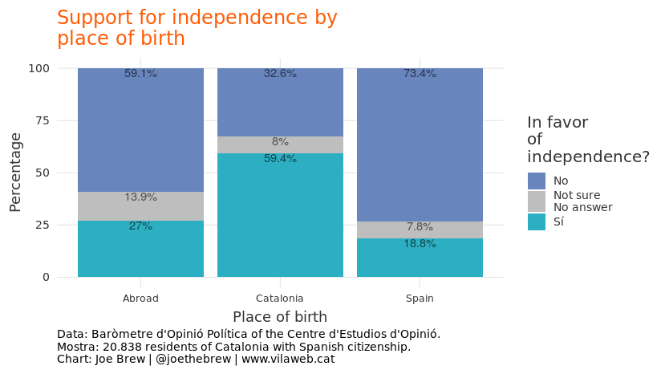<!-- -->

And the below shows the association between age and support for
independence. Young Catalans are largely in favor of independence,
whereas older Catalans are largely opposed.

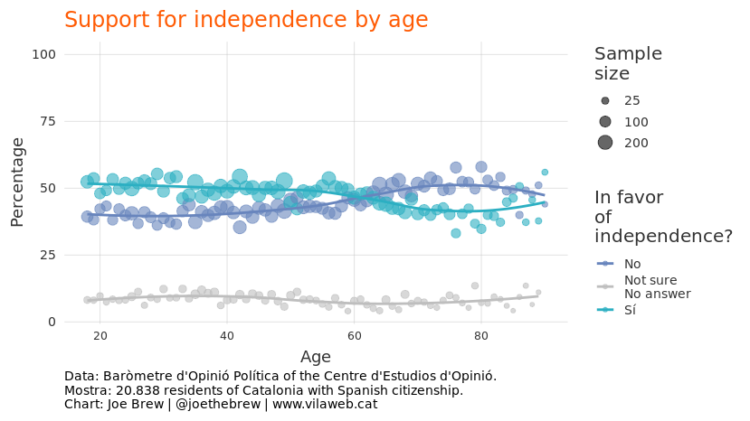<!-- -->

Let’s dive into the details.

# Describing the present

There is an important demographic trend taking place right now in
Catalonia: the percentage of Catalans who were born in Spain is
decreasing. One can only speculate whether this trend played a role in
the rapid increase in support for independence in recent years, but the
data are clear - over the last 20 years, the percentage of Catalans born
in Spain decreased from 27.2% to 16.6%.

<!-- -->

Why has the percentage of Catalans born in Spain decreased? It’s not
because they are leaving Catalonia to return to Spain. Rather it’s
because the Spanish-born population of Catalonia is far older than the
average population of Catalonia. The below chart shows the distribution
of the age of Catalans by place of birth:

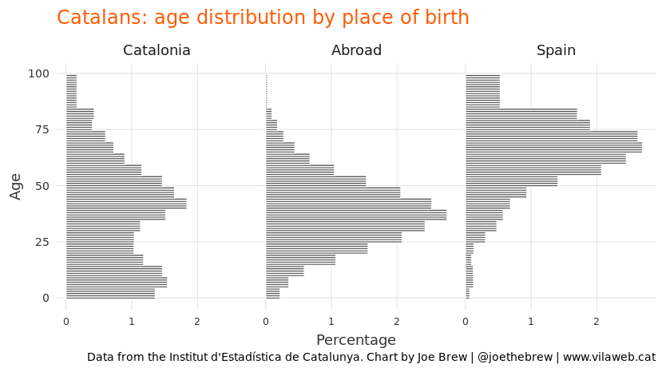<!-- -->

Note in the chart above how in the right-most planel, data are clumped
higher, whereas in the left-most and central panel, data are distributed
lower. Most Catalans who were born in Spain are old: whereas the median
age of Catalans born in Catalonia is 38 and the median age of Catalans
born in the rest of the world (not counting Spain) is 37, the median age
of Catalans born in Spain is 64. Three-quarters of Catalans born in
Spain are 55 or older.

In other words, the decrease in the percentage of Catalans who were born
in Spain is due largely to mortality, not emigration.

Why does this all matter? Because the old, here and everywhere, will
continue to die before the young. And unless the migration patterns of
the future are identical to the migration patterns of the past (which
they almost certainly willl not be), these deaths will leave a mark on
collective political preferences.

# Predicting the future

With its current demographic make-up, Catalonia is split approximately
50-50 on the question of independence. Let’s see what is likely to
happen in a few years.

The below shows what will happen to Catalonia’s *current* population
over time. Since most Catalans who were born in Spain are older, their
share (as a percentage of the total Catalan population) will decrease
over time.

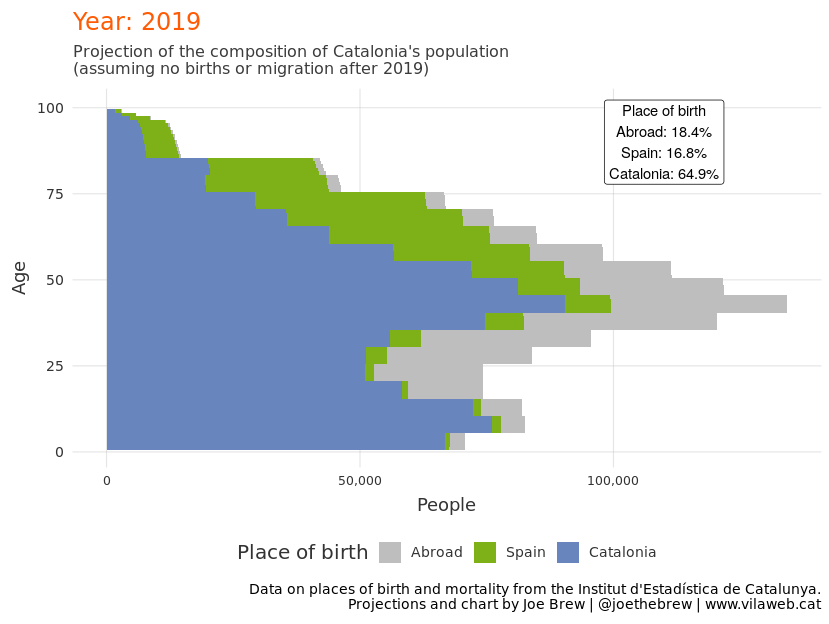<!-- -->

If we examine only mortality (ignoring, for the moment, migration and
fertility), Catalonia’s population by place of birth would look like
this over the next 100 years.

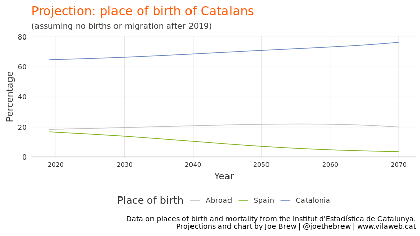<!-- -->

Note the difference in the grey (abroad) and green (Spain) lines. Though
the percentage of Catalans who are born in Spain vs. born in the rest of
the world are similar now (approximately 17-18%), they will diverge
sharply in the near future. The reason why is because foreign-born
Catalans are relatively young compared to Spanish-born Catalans.

The result of these differences in ages is this: even if nobody changes
their mind, the percentage of Catalans in favor of independence will
increase steadily over the next few decades. Because so many
anti-independence Catalans are elderly, support for continued union with
Spain will decrease steadily as the elderly pass away. The below shows
the estimated percentage of Catalans in favor and opposed to
independence, assuming (a) opinions don’t change and (b) only mortality
(not migration and fertility) affect the population structure.

<!-- -->

Is it reasonable to assume that there will be no new births and no new
migration to or from Catalonia in the future? Of course not. Just as
people (sadly) cease to exist, so too can they be created. Birth is one
way. The other way (at least for our purposes) is migration.

Even though it is impossible to predict the future of migration and
births, it is wrong to ignore them. So, for this exercise, we’ll simply
make some assumptions: that the number of annual births in Catalonia
will remain the same as now (or rather, 2017, the most recent year for
which data is available), and that the number of migrations (both to and
from Spain and the rest of the world) will remain constant as well
(using the average from the period of 2005 to 2017)

With these assumptions made, Catalonia’s population looks like this over
the next few years:

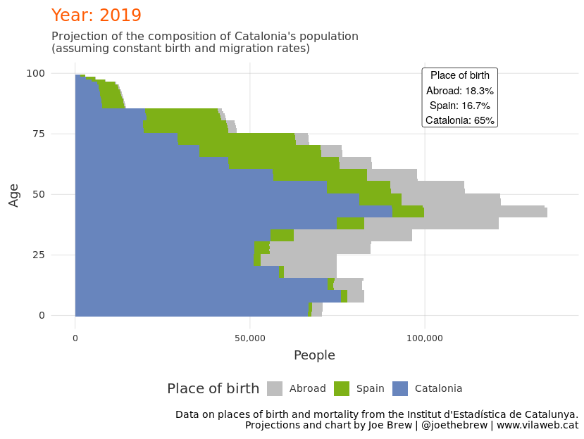<!-- -->

What effect will this have on support for independence? The below shows
estimated support for independence, assuming no changes in opinions,
future migration rates identical to those of the last 10 years, and
future birth rates identical to that of 2017. The effects of demographic
change will be seen, even in the short-term:

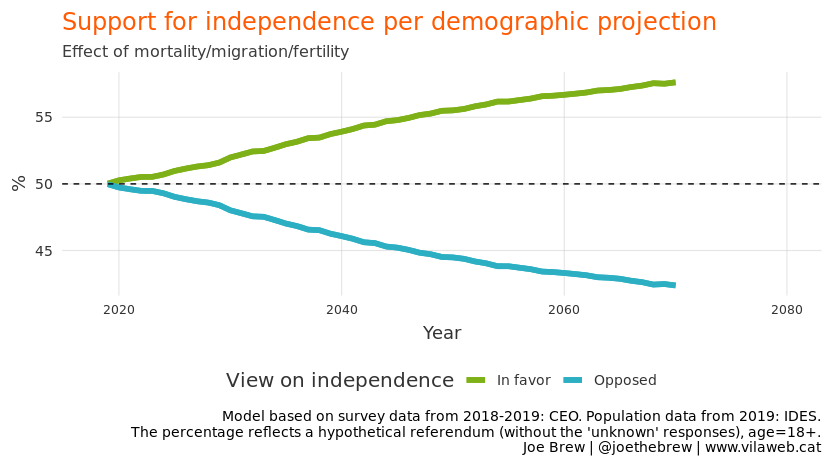<!-- -->

In other words, even if ZERO people change their minds, the 50-50 split
will not continue.

# Conclusion

Time is working against those who oppose Catalan independence. Catalans
who were born in Spain - a bastion of support for the Spanish unionist
movement - are largely elderly and are being replaced by younger
Catalans born in Catalonia (largely in favor of independence) and
younger Catalans born abroad (who, for the most part, cannot vote).
Regardless of your opinion on independence, these are the facts.

I argue in this article that minds rarely change, and I believe firmly
that this is the case for most political issues. It is for this reason
that demographic change is important to understanding Catalonia’s
future. With fossilized opinions on both sides, it is unlikely that
there will be any major “conversions” in near-term.

That said, unlikely does not mean impossible. Minds *do* ocasionally
change on some issues. Perhaps a Spanish Government will propose a
political settlement which is acceptable to a majority of Catalans (so
far this hasn’t happened). Perhaps Catalans will grow tired of seeking
independence, and will settle for some modified version of their current
autonomy. Or perhaps some freak event will change the entire
conversation.

But barring the above, the most likely course of events is this: the
Catalan independence movement will continue to grow in numbers, and a
Spanish Government (perhaps not the current one, since its official
position on Catalan self-determination is “no is no, never is never”)
will be forced to recognize the political reality and work for a
political solution. A solution almost certainly involves a referendum on
independence and - unless minds radically change in the coming years -
this referendum will be won by the pro-independence camp.

## Technical note

This article contains many projections, which - like all projections -
are almost certainly inaccurate. Though actuarial science is fairly
accurate (life expectancies, etc.), forecasting migration and fertility
is largely a guess. For the purposes of transparency, all code and data
used for this article is publicly available online at
<https://github.com/joebrew/vilaweb/tree/master/analyses/demography>.

# Catalan-language plots

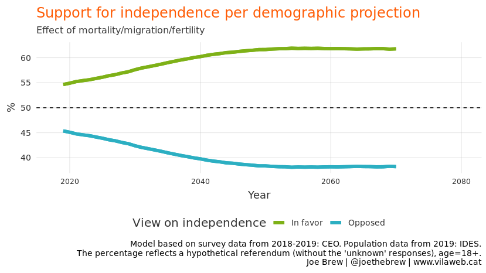<!-- -->

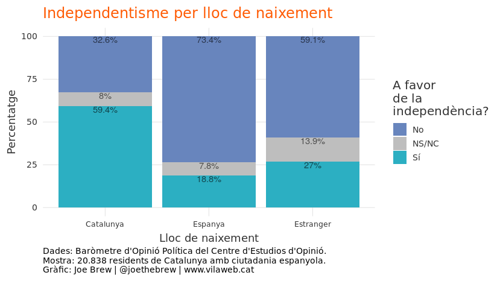<!-- -->

<!-- -->

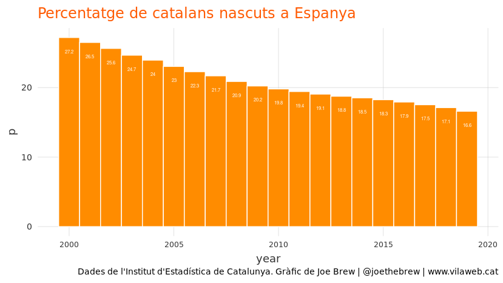<!-- -->

<!-- -->

<!-- -->

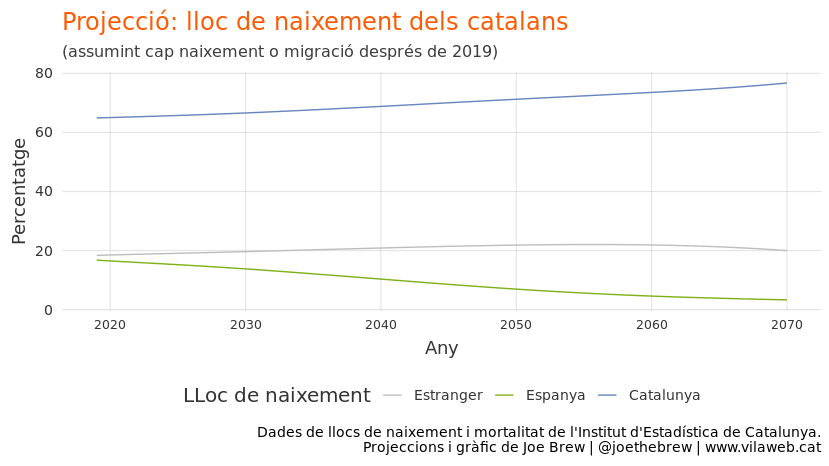<!-- -->

<!-- -->

<!-- -->
