No, Catalonia is not a ‘divided’ society
================

## Catalans overwhemingly oppose imprisonment for their elected representatives and favor a self-determination referendum

The Spanish Government has been making a concerted effort to depict
Catalonia as a divided society. The notion of a “divided” or
“fragmented” Catalonia fits well with Spanish President Pedro
Sánchez’s refusal to dialogue with Catalan representatives about the
current political crisis. The argument goes like this: before Spain can
consider dialogue with Catalonia, [“Catalonia must enter into a dialogue
with
itself”](https://twitter.com/sanchezcastejon/status/1183721720445845505).
In other words, because Catalans are in disagreement, there is no sense
in Spain taking any action.

It’s a questionable strategy, even if we assume its underlying premises
to be true. But there’s another problem with Spain’s inaction and
refusal to dialogue: the underlying premise of a divided Catalonia is
false. *Yes*, Catalans are split on the question of independence (hence
the call for a referendum, to clarify the numbers). But *No*, Catalonia
is not a “divided society”, at least in terms of the causes and
solutions for the current political crisis. On the matters of (1) the
imprisonment of Catalan politicians and social activists, and (2) the
right to self-determination, Catalonia is actually fairly united. Let’s
dig into the
data.

# 1\. A broad consensus against the imprisonment of Catalan representatives

The cause of the unrest in Catalonia over last week is not just
Catalonia’s independence. On this matter, few minds have changed over
the last few years.

The cause of the recent unrest was the sentencing of a dozen Catalan
politicians and activists to between 9 and 13 years of prison each for
having organized an independence referendum. They were convicted of
“sedition” (a crime of violence), despite never having never used,
accepted, or encouraged any acts of violence. At the time of conviction
they had already spent up to two-years in “preventive” prison, and -
despite several of them being elected and re-elected to office - have
been prohibited from carrying out their political duties.

On the matter of these imprisonments, there is a clear consensus in
Catalonia. Only 18% of Catalans consider the imprisonment of their
politicians to be fair, 14% aren’t sure and more than two-thirds of
Catalans considers say that imprisonment is not fair.

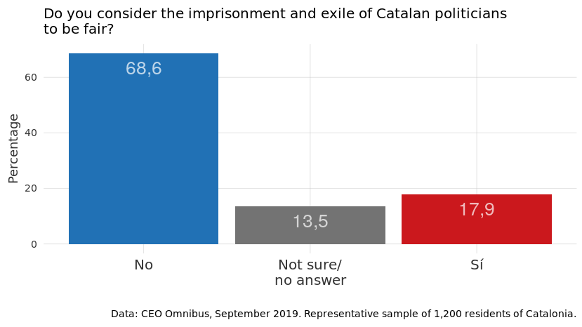<!-- -->

Only in two hard-line Spanish nationalist parties (the Popular Party -
PPC, and Citizens - Cs) is there support for imprisoning the Catalan
politicians. In the pro-independence parties, expectedly, there is
virtual unanimity against imprisonment. But what’s most striking is the
stance of the anti-independence, left-leaning parties. 92% of the voters
of the leftist “Comuns” party consider that the imprisonment of Catalan
politicians is unjust, and 58% of Catalan socialists consider it unjust.

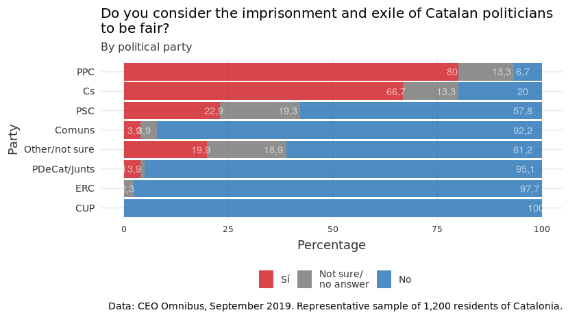<!-- -->

# 2\. A broad consensus in favor of self-determination

In Catalonia, there is a broad consensus in favor of self-determination.
This consensus naturally includes all those who are in favor of
independence, but also significant portions of Catalans who are opposed
to independence. In other words, most Catalans - including many who wish
to remain part of Spain - want to decide the issue through a referendum.

The most recent survey on the subject asked 1.200 systematically sampled
Catalans the extent to which they agree with the following phrase: “A
referendum should take place in Catalonia so that Catalans can decide
what relationship they want there to be between Catalonia and Spain”
(“S’hauria de fer un referèndum a Catalunya perquè els catalans i
les catalanes decidissin quina relació volen que hi hagi entre Catalunya
i Espanya”). The results are below.

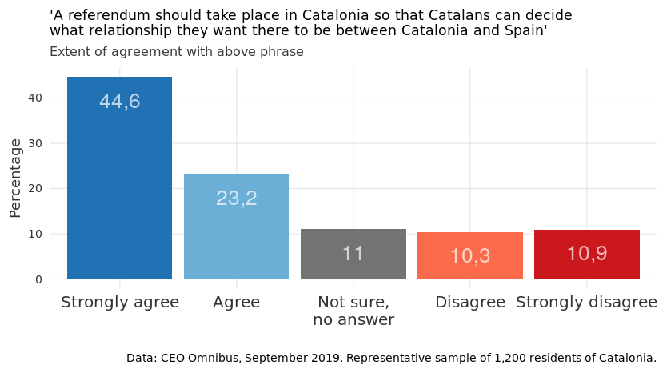<!-- -->

Only 21.2% of Catalans are opposed to a referendum. More than two-thirds
are in favor (and if we remove the 11% who don’t have an opinion on the
matter, the percentage in favor is 76%).

It’s important to emphasize that this is not a one-off, spurious result.
This has been the case for at least those years for which reliable data
are available, and the pro-referendum majority (about 75%) remains
constant even when you formulate the question differently. For details
on this, see my article
[here](https://english.vilaweb.cat/noticies/only-19-of-catalans-oppose-a-self-determination-referendum/).

It’s also worth noting that significant portions of voters of
anti-independence parties are actually pro-referendum. For example,
fewer than 10% of Comuns voters oppose a referendum, and the Catalan
socialists are split 50-50 on the matter.

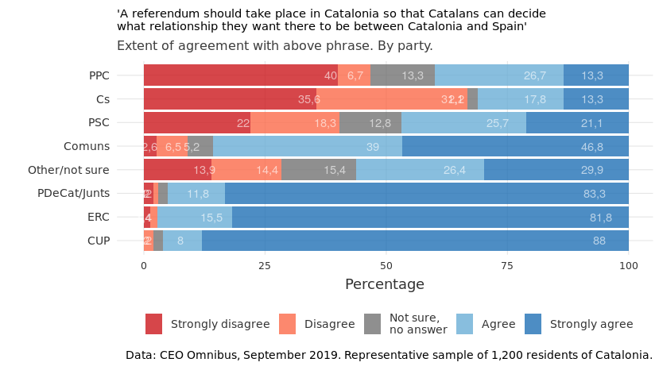<!-- -->

In Catalonia, enthusiasm for a referendum is greatest on the left, but
garners support from the center and center-right as well. The only
political sector where opposition to a referendum is greater than
support for it is among Catalans who self-classify as “far right”.

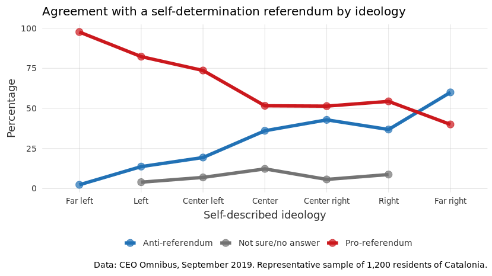<!-- -->

Among Catalans born in Catalonia (most are), nearly 80% want a
referendum, and only 15% oppose. Catalans born in the rest of Spain, or
abroad, also favor a referendum, albeit by a lesser margin.
<!-- -->

# Conclusion

Pedro Sánchez’s government is right to say that Catalonia is divided
regarding independence: about half want it and about half don’t (the
numbers vary from survey to survey, but are fairly close to a 50-50
split over the last two years). This is the norm in democracy: people
disagree on things, but agree on settling their disagreements
democratically. In other words, differential preferences for a political
*outcome* does not necessarily mean disagreement on how the outcome
should be decided. In fact, if there weren’t disagreement on
independence, there would be no need for a vote (since the result would
already be known), as is the case in almost every region in every
country of the world.

Catalans are overwhelmingly opposed to the imprisonment and exile of
their elected politicians, and they are overwhelmingly in favor of a
self-determination referendum. These two consensuses explain the popular
revolt taking place in Catalonia, as well as the political deadlock. Two
address the Catalonia-Spain conflict, President Sánchez would be wise to
recognize that on these questions, Catalans are largely in agreement. In
other words, the disagreement is not between Catalans, but rather
between (a) the consensus solution proposed by Torra’s Catalonia
(freedom for the imprisoned politicians and a self-determination
referendum) and (b) the counter-offer being made by Sánchez’s Spain (law
and
order).

# Catalan-language plots

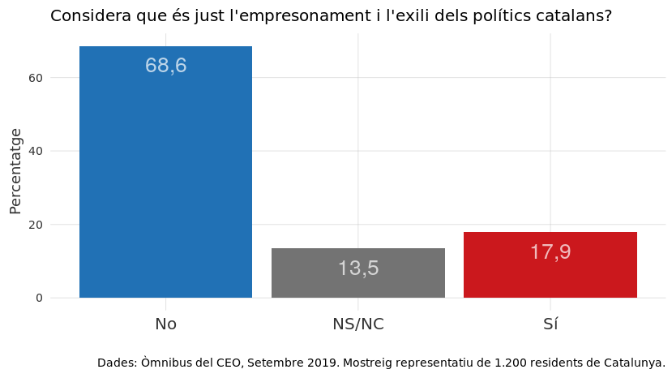<!-- -->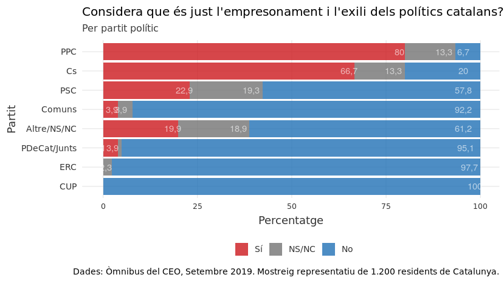<!-- -->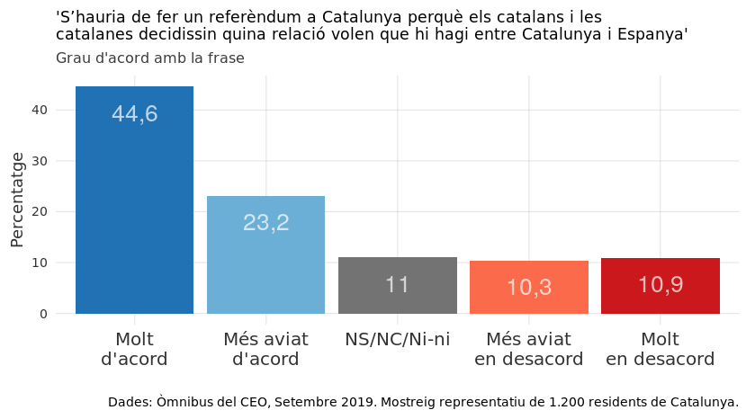<!-- -->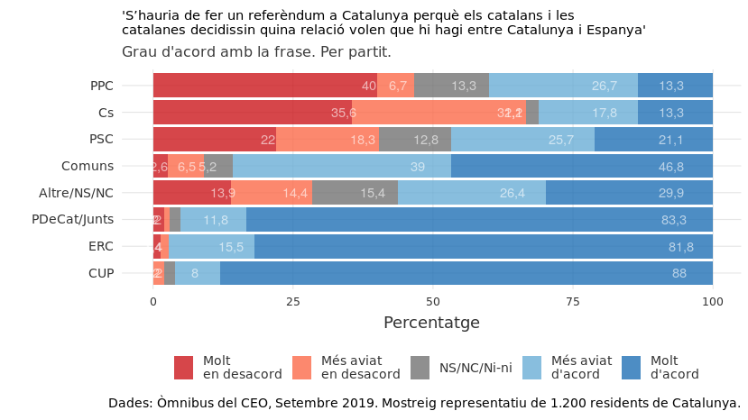<!-- -->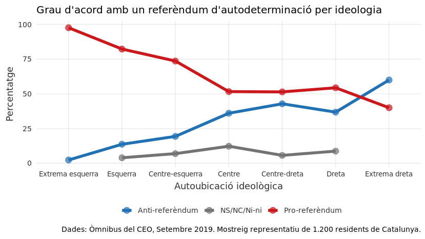<!-- -->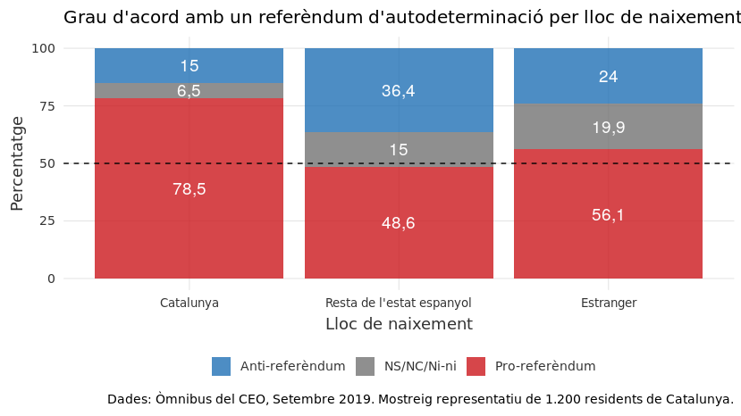<!-- -->

\`\`\`

# Technical details

The code for this analysis is publicly available at
<https://github.com/joebrew/vilaweb/tree/master/analyses/facts>.
