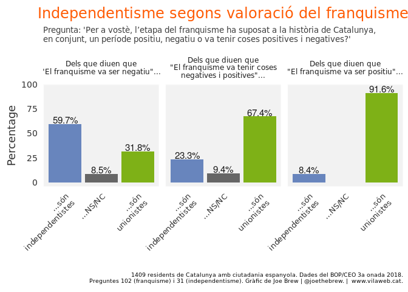
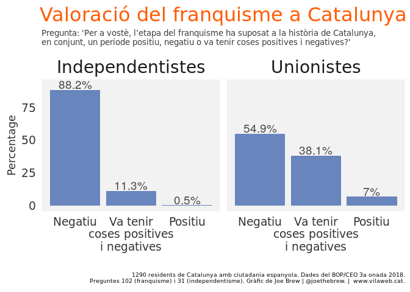
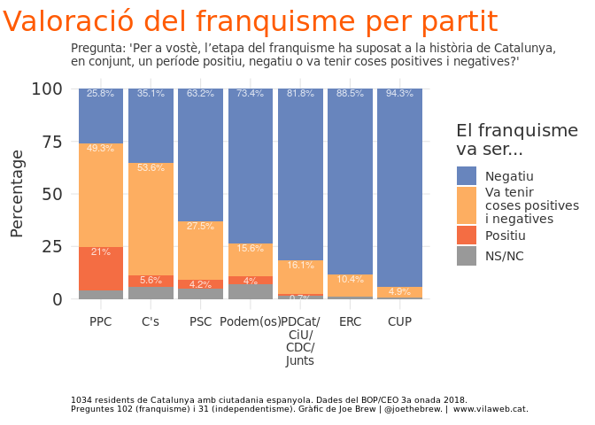
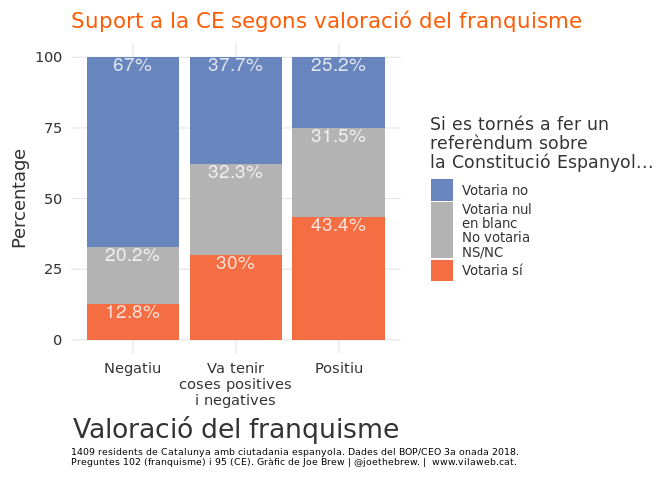

El franquisme i l'independentisme
================

Introducció
===========

S'acusen als sobiranistes catalans de ser moltes coses: de dretes ([quantitativament fals](https://www.vilaweb.cat/noticies/dada-joe-brew-independentisme-dreta-esquerra/)), de xenófobs ([quantitativament fals](https://twitter.com/joethebrew/status/1107874957495681024)), de violents ([quantitativament fals](https://www.vilaweb.cat/noticies/els-dirigents-unionistes-no-van-parlar-de-violencia-durant-els-dies-doctobre-on-ara-diuen-que-hi-va-haver-violencia-les-dades/)), de minoritaris ([tampoc és veritat](https://www.vilaweb.cat/noticies/independentisme-majoritari-joe-brew/)), etc.

Però mai havia sentit a ningú acusar el moviment sobiranista de "franquista." Fins aquesta setmana.

En [una entrevista publicada el 18 de març](https://www.elcatalan.es/entrevista-a-jose-antonio-montano-lo-mas-parecido-hoy-al-franquismo-es-el-nacionalismo-catalan), José Antonio Montano va dir que "el más parecido al franquismo... es el nacionalismo catalán". Després de llegir aquesta comparació, pensava en possibles anàlisis per confirmar o rebutjar - amb dades - la relació independentisme-franquisme que sugereix el Senyor Montano. Existeix? Els independentistes són franquistes?

Quines dades podria analitzar? D'una banda, algunes actituds de Generalísimo són notories - el seu catolicisme, la seva adversió al comunisme, la seva obsessió amb la lleialtat i la autoritat. Potser podria trobar dades sobre aquests temes. Buscant això, però, vaig trobar alguna cosa molt millor: dades sobre la valoració del franquisme mateix. Específicament, una pregunta joia que es va fer al BOP (Baròmetre d'Opinió Política) en la tercera ronda de 2018 a 1.500 catalans.

La pregunta és aquesta: "Per a vostè, l’etapa del franquisme ha suposat a la història de Catalunya, en conjunt, un període positiu, negatiu o va tenir coses positives i negatives?"

Quina pregunta més perfecta! Quina manera millor de provar la hipòtesi de Montano (l'independentisme és com el franquisme)! Gracies a aquesta pregunta, podrem veure exactament que pensen els catalans (independentistes i no) sobre el Franco!

Fem-ho.

Metodes
=======

Vaig descarregar les dades "crues" de la [3a onada del BOP](http://ceo.gencat.cat/ca/barometre/detall/index.html?id=6868) del Centre d'Estudis d'Opinió. Aquesta enquesta, administrada per Opinòmetre SL, fa servir [técniques de mostreig riguroses](http://upceo.ceo.gencat.cat/wsceop/6868/Fitxa%20t%C3%A8cnica%20-908.pdf) per que la mostra final representi bé a Catalunya. Amés, i a diferència de moltes enquestes que es publiquen amb freqüencia en alguns mitjans, el BOP és (a) presencial (el que evita el biaix de fer enquestes telefonicament) i (b) restringit als catalans amb ciutadania espanyola (i per tant, reflecteix bastant bé el que serien resultats electorals reconeguts per l'Estat Espanyol). De les 1.500 enquestats, 1409 van donar una resposta a la pregunta sobre el franquisme, i 1355 van contestar a la pregunta sobre la independència. Vaig examinar les associacions entre les valoracions del franquisme i les opinions sobre la independència de Catalunya, així com els partits polítics dels enquestats i la seva opinió sobre la Constitució Espanyola.

Tot el còdi i les dades d'aquest anàlisi són publicament disponibles: <https://github.com/joebrew/vilaweb/tree/master/analyses/franquisme>

Resultats
=========

Valoració del franquisme a Catalunya
------------------------------------

El gràfic següent mostra la valoració dels catalans del franquisme.

3 de cada 4 catalans diuen que el franquisme ha suposat un període negatiu per a la història de Catalunya. I aquest altre 25%? Qui són? Són independentistes (se el Senyor Montano té raó, han de ser)? Mirem-ho.

Franquisme i independentisme
----------------------------

El gràfic següent mostra tres grups: els que diuen que el franquisme va ser negaitu per a Catalunya (a l'esquerra), els que diuen que "va tenir coses negatives i positives", i els que diuen que va ser positiu (a la dreta). Dins de cada grup, es mostra el perfil independentista (altura de les barres).

La gran majoria dels catalans que diuen que el franquisme va ser negatiu són independentistes (59.7%). I la gran majoria dels que diuen que el franquisme va ser positiu són unionistes (91,6%).

Mirem les dades d'una altre manera. En lloc de preguntar quin percentage dels franquistes catalans són independentistes (8,4%), mirem quin percentage dels independentistes són franquiestes.

El gràfic següent mostra la valoració del franquisme pels catalans independentistes (a l'esquerra) i unionistes (a la dreta). Les diferències són remarcables.

El 88,2% dels independentistes diuen que el franquisme va ser negatiu per a Catalunya. Entre unionistes, gairebé la meitat (54,9%) diuen que el franquisme va ser negatiu.

Per partit
----------

Mirem les valoracions del franquisme per partit:

En els partits més espanyolistes (el PP i Ciutadans), el percentage de gent que diu que el franquisme va ser negatiu és minoritari (25,8% en el PP i 35,1% en Ciutadans). La majoria en aquests partits diuen que el franquisme va ser positiu o va tenir coses positives i negatives.

Els socialistes catalans valoren el franquisme de manera més negativa que els del PP i C's, tot i que més de 2 de cada 3 socialistes no fan una valoració exclusivament negativa del franquisme. Els partits sobiranistes són els més anti-franquistes.

El franquisme i la Constitució Espanyol
---------------------------------------

És interessant també veure la relació entre les actituds franquistes i la valoració de la Constitució Espanyola. Afortunadament, com que el BOP fa públiques les seves dades, podem fer aquest anàlisi. El següent gràfic mostra el suport a la Constitució Espanyola (si es votaria a favor o en contra si es tornés a celebrar un referèndum sobre la CE avui) segons la valoració del franquisme (eix X).

L'associació entre la valoració positiva del franquisme i el suport a la Constitució Espanyola és bastant clara. En un referèndum avui sobre la CE, el "Sí" guanyaria a Catalunya només en el sector (petit) de la població que diu que el franquisme va ser positiu. En el sector ambigu (el franquisme va tenir coses negatives i positives), guanyaria el "No" probablement, però dependria de com voten els "NS/NC". I en el sector que valora de manera negativa el franquisme, el "No" a la Constitució guanyaria de manera clara: en aquest grup, menys de 13% votaria "Sí" a la CE.

Conclusio
=========

Els catalans franquistes són majoritariament unionistes (91,6%). I els independentistes catalans rebutgen el franquisme de manera gairebé unànime (88,2%), mentres que els catalans unionistes fan una valoració del franquisme molt més ambigua (45% dient que va ser positiu o va tenir coses positives). A menys que el Senyor Montano tingui una altre font de dades del qual l'existència desconec, sembla que s'hagi equivocat al dir que l'independentisme català és "parecido" al franquisme.

Reflecció personal
==================

Jo, personalment, no m'agrada parlar del Franco. La seva omnipresencia a la política espanyola i catalana em molesta. N'estic fart.

Però mentres hi hagi partits polítics on el rebuig al feixisme és minoritari i la majoria diu que el franquisme "va tenir coses positives" (PP i C's), cal parlar-ne, que ens agradi o no. El feixisme desapareixerà quan es canviïen les actituds, no quan s'hagi acabat de parlar d'ell. I per canviar les actituds, s'ha de treballar per comprendre les actituds. Afortunadament, més enllà de les opinions, n'hi ha dades.

Agraeixo al Senyor Montano d'haver començat la conversa sobre la relació entre l'independentisme i el franquisme, i li convido a continuar-la amb aquestes dades, les objectives, a la mà.
