Interest, information, and independentism
================

# Introduction

The result of Britain’s 2016 vote to leave the UK was a shock to many.
Driven largely by older, right-leaning, anti-immigration eurosceptics,
the vote to “leave” beat the vote to “remain” 51,9% vs 48,1%. The UK is
still wrestling with how to implement the result.

One of the most fascinating findings from [survey analysis of Brexit
voters](https://lordashcroftpolls.com/2019/03/a-reminder-of-how-britain-voted-in-the-eu-referendum-and-why/)
is that much of Brexit support came from Brits who *paid little or no
attention to politics*. In a very large poll (12.369 people) carried out
the day of the Brexit vote, [Lord
Ashcroft](https://lordashcroftpolls.com/about/) showed that the more one
paid attention to politics, the less likely (s)he was to vote for
Brexit.

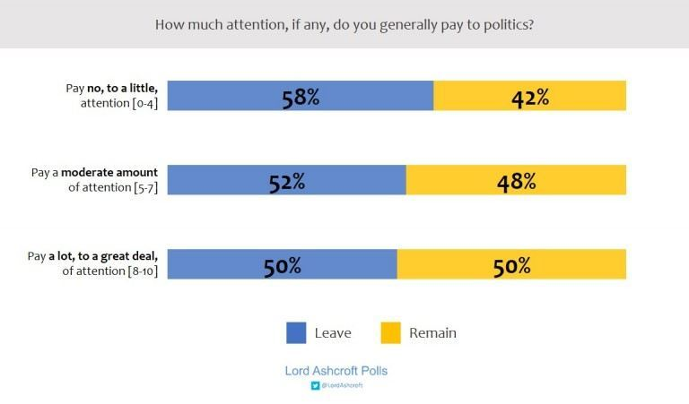

The correlation between level of interest/engagement in politics and
certain political attitudes is not unique to Brexit. In the US, the [Pew
Research
Center](https://www.people-press.org/2017/10/24/1-partisanship-and-political-engagement/)
has shown that those who say they “pay attention to politics” are
generally more likely to vote for the democratic party, whereas those
who say they pay less attention are more likely to vote for the
Republican party. Trump’s support comes disproportionately from those
who don’t pay engage or show substantial interest in politics.

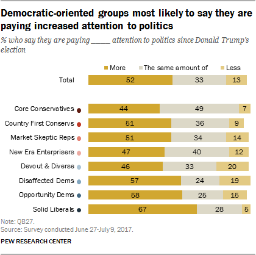

What’s the case in Catalonia? Who is engaged (interested and informed)
about what’s happening in politics, and what is political engagement’s
association with support for independence and self-determination? Let’s
take a look at the data.

# Data

We’ll use [CEO/BOP data](http://ceo.gencat.cat/ca/inici), a regular
survey of Catalans on their political opinions. We’ll examine the survey
questions pertaining to interest in politics and level of being informed
about politics.

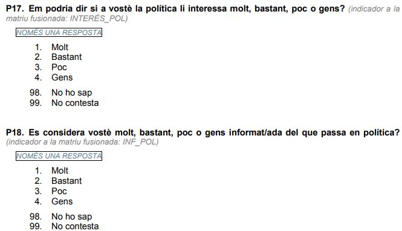

# Results

## Self-determination

It’s worth starting with an often neglected fact: a large majority of
Catalans favor self-determination, with fewer than 20% being explicitly
opposed.

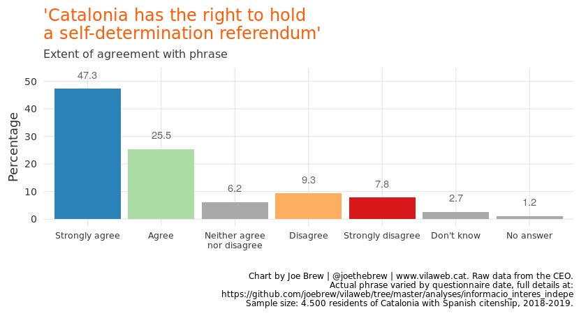<!-- -->

What’s the association between support for a self-determination
referendum and interest in politics? Removing those who don’t answer the
question on self-determination or level of interest in politics yields
the following result:

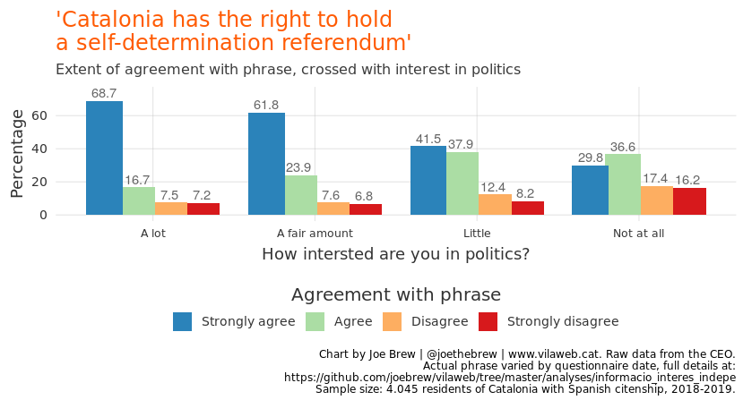<!-- -->

The more one professes interest in politics, the greater his/her support
for a self-determination referendum. The group with the least support
for self-determination comes from those who say that they don’t pay any
attention to politics.

What about level of information (grau d’informació) and support for or
opposition to self-determination? The below chart shows support for a
self-determination referendum, crossed with how informed one considers
him/herself to be about what is going on in politics:

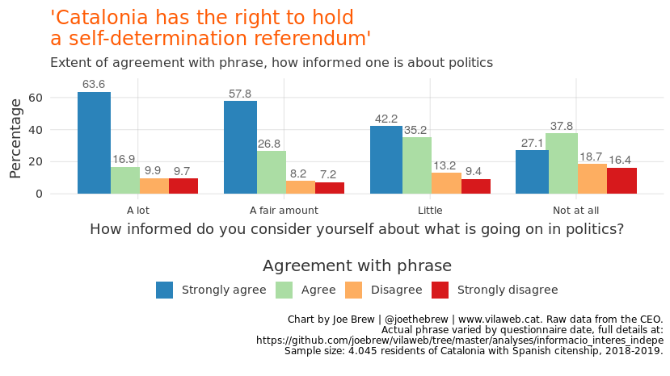<!-- -->

The correlation in the above is clear. Among those who consider
themselves well informed about what is happening in politics, support
for a referendum is very high (80,5%). Opposition to a
self-determination referendum largely stems from Catalans who say that
they are “not at all” informed about what is happening in politics.
However, in all groups a majority favor a self-determination referendum.

## Independence

Surveys are somewhat volatile (due to small sample sizes and bias), but
we can get more reliable results by aggregating them. The below shows
the combination of all CEO BOP surveys from 2018-2019 (3 in 2018, 2 in
2019). The split is close to 50-50%, but more Catalans want to be
independent than remain part of Spain.

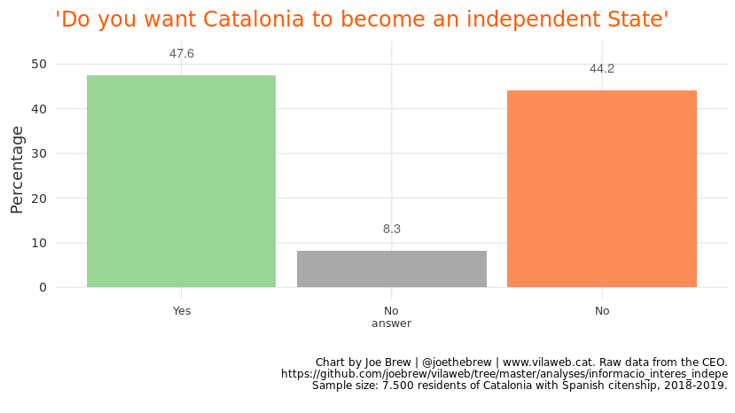<!-- -->

The association between interest in politics is even stronger if we look
at preferences for independence. Among those who consider themselves
very interested in politics, support for independence is more than
double that of support for union with Spain. The pattern is similar
among those who consider themselves fairly interested in politics.

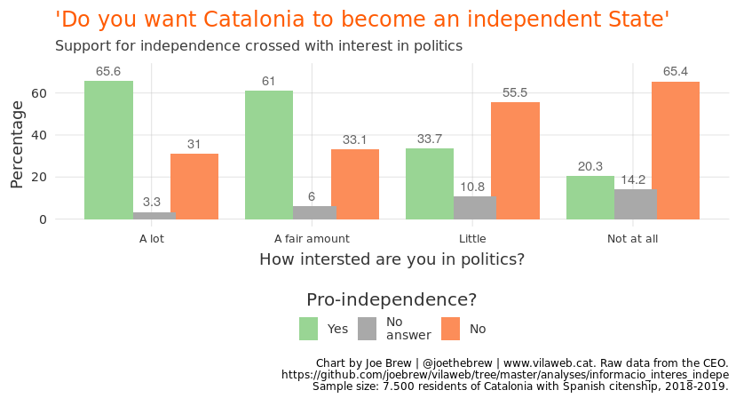<!-- -->

Opposition to independence is greater than support for independence only
among those who consider themselves to be not very interested in
politics (“poc” o “gens”). Among those “not at all” interested in
politics, support for independence is only 20,3%, and opposition to
independence is 65,4%.

If we look at level of information (grau d’informació), a similar trend
emerges:

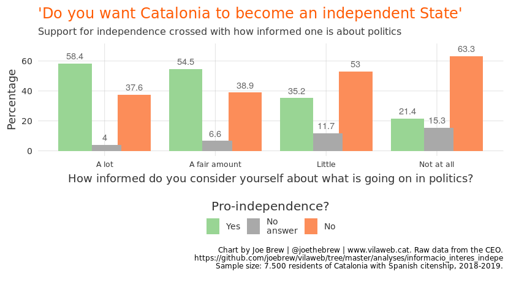<!-- -->

Those who consider themselves to be informed about what is going in
politics are generally in favor of independence, whereas those who
consider themselves not very informed about politics are generally
opposed. The greatest opposition to independence is among the group
which considers itself least informed about what’s going on in politics.

## By party

Interest in politics and being informed about politics also varies
widely by *party*. The below shows interest in politics by party of
preference.

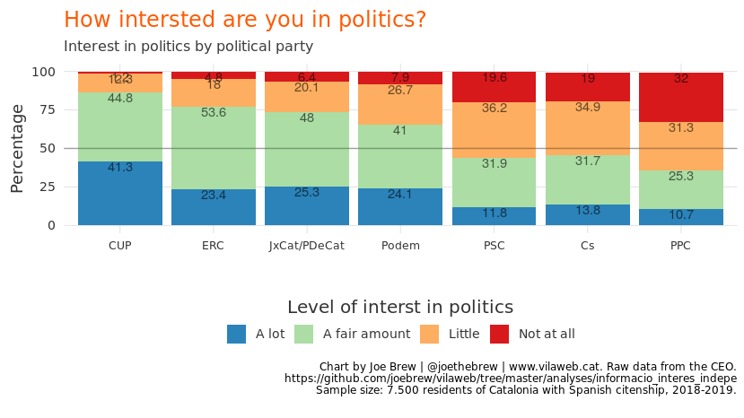<!-- -->

Those who support pro-independence parties (and anti-independence but
pro-sovereignty “Podem”) largely consider themselves interested in
politics. Supporters of unionist parties largely consider themselves
uninterested. Nearly two-thirds of PP voters consider themselves just a
“little” interested or “not at all” interested in politics.

And the below shows level of information about politics by political
party:

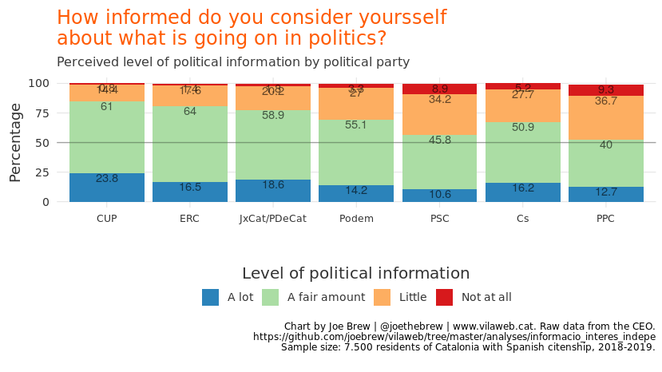<!-- -->

A majority of voters of all parties consider that they are fairly
informed about politics, but the rates are higher among pro-independence
party voters than pro-union party voters.

# Conclusion

In Catalonia, engagement in what’s happening in politics (interest and
information) is associated with greater levels of support for
independence. In the sense, the pro-independence movement is quite
unlike the populist movements with which it is often compared (Brexit,
Trump, etc.), not only in terms of political engagement, but also on a
[myriad of other
measures](https://www.vilaweb.cat/noticies/brexit-independencia-joe-brew/).
Whereas support for neo-populists like Donald Trump, Boris Johnson, or
Marine Le Pen are generally driven by a disatisfaction and
*disconnection* with politics, pro-independence Catalans profess high
levels of interest in politics.

Opposition to self-determination and independence stems largely from
Catalans who say that they are not interested in what is happening in
politics, and consider themselves to not be very well-informed about it.
Whether paying attention to politics *causes* support for independence,
or whether the causal chain is the other way around (ie, being in favor
of independence *causes* one to engage in politics) is unknown. It is
also unknown the extent to which self-rated values (level of interest,
level of information) are reliable. In either case, those who support
continued union with Spain should be concerned that their base is
largely uninterested, and considers itself uninformed, of what’s going
on in politics.

# Technical details

All code and data for this article are available at
<https://github.com/joebrew/vilaweb/tree/master/analyses/informacio_interes_indepe>.

# Catalan language charts

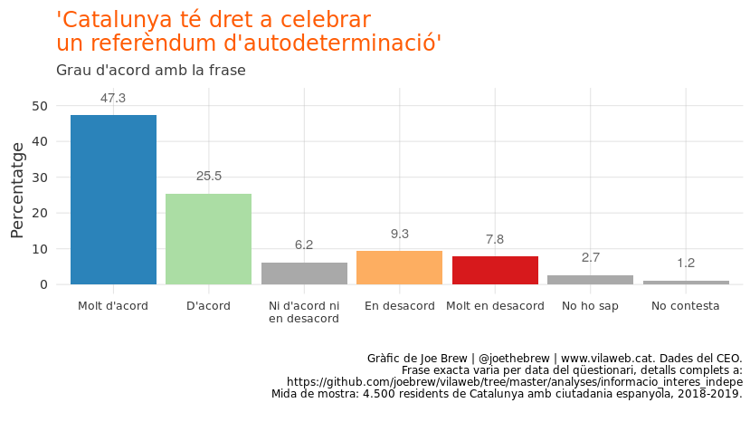<!-- -->

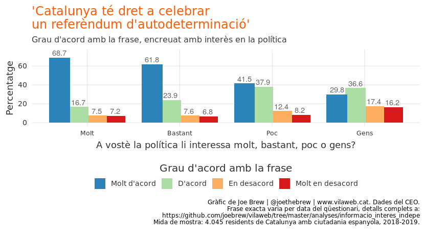<!-- -->

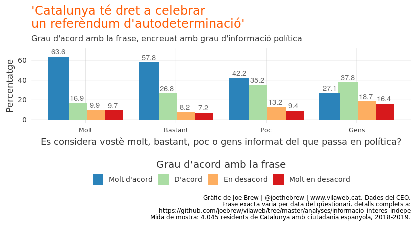<!-- -->

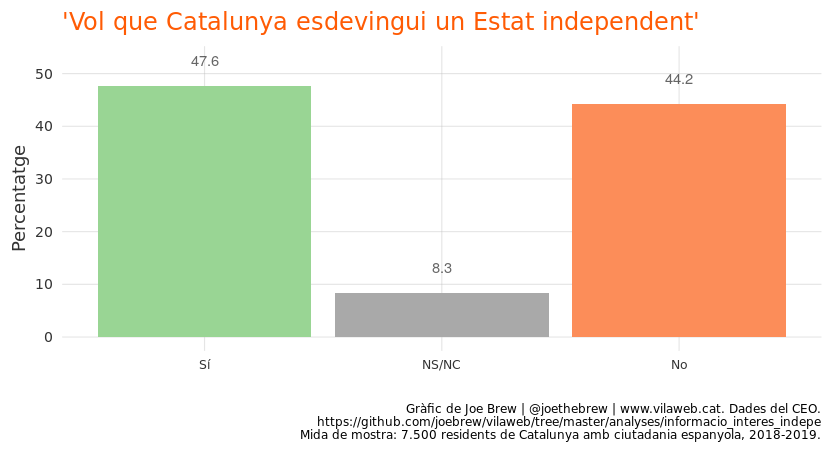<!-- -->

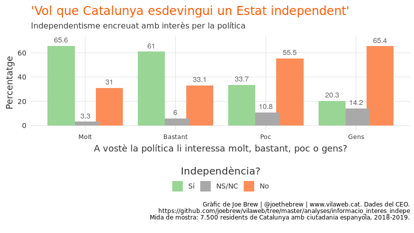<!-- -->

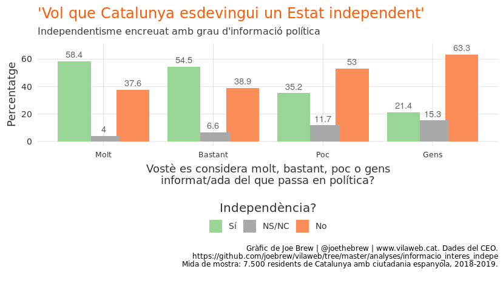<!-- -->

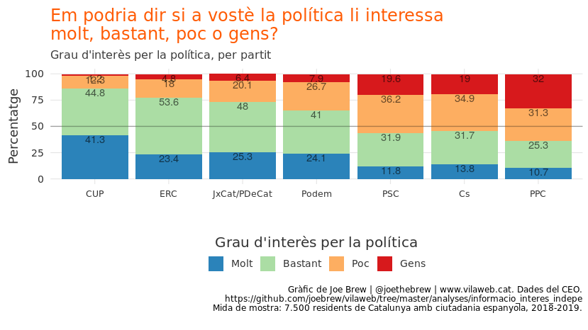<!-- -->
