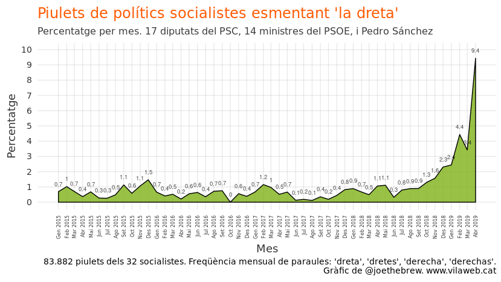
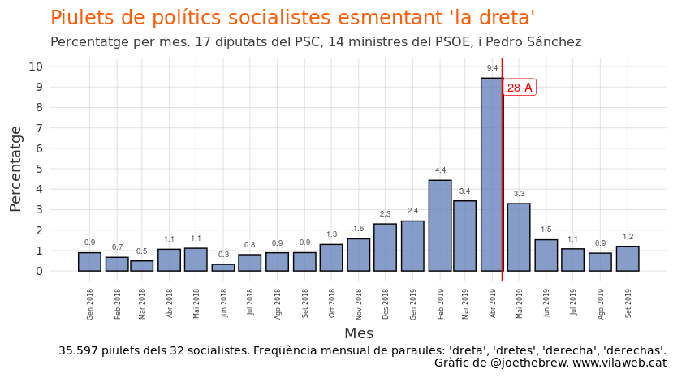
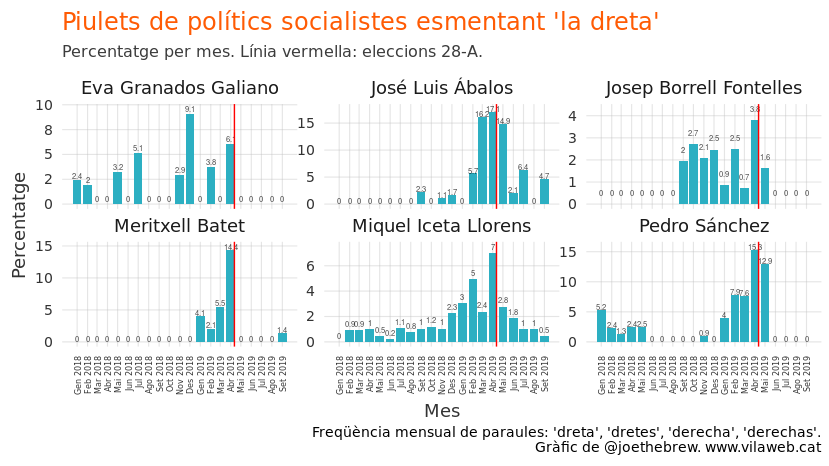
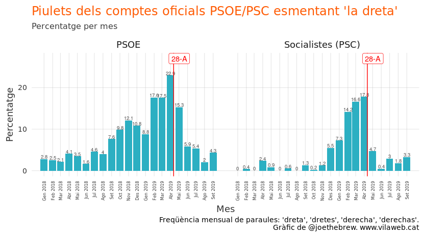

Però… que no venia la dreta?
================

(Alternative title: “Què passa Sr. Sánchez, que ja no va la dreta?”)

# La importància de l’adversari

Tot i que tots els polítics diguin que volen fer campanyes “en positiu”
- és a dir, destacant els avantatges de les seves propostes polítiques
sense criticar massa els dels altres - la realitat demostra el contrari.
Els polítics parlen constantment dels altres polítics, i solen parlar
més dels seus adversaris que dels seus aliats. Per què? Perquè
l’estratègia paga: parlar de l’adversari fa que la base es mogui.
Tots ho fan. Cap polític es capaç de resistir a la tentació de criticar
l’adversari, perquè l’adversari és un concepte políticament massa útil.

Donada la universalitat de l’estratègia, resulta dificil fer
comparacions entre partits diferents. En canvi, encara que no es pogui
comparar el “què” (perquè l’estratègia de parlar de l’adversari és
universal), sí que es pot comparar el “qui”: quin adversari seleccionen
els partits, quan i per què canvien d’adversari, i quin resultat esperen
amb l’elecció d’un adversari o un altre.

# Eleccions 28-A: la dreta és l’adversari

L’estratègia del partit socialista per les eleccions del 28-A era
emmarcar com a adversari la dreta. Es pot quantificar aquesta estratègia
només mirant la freqüencia amb la qual Pedro Sánchez, i altres dirigents
socialistes, esmentaven “la dreta” durant la campanya. El gràfic següent
mostra el percentatge de piulets mensuals que contenen les paraules
“derecha”, “derechas”, “dreta”, o “dretes” dels principals polítics
socialistes catalans i espanyols:

<!-- -->

El que destaca és el fort augment en la freqüència de referències a la
dreta en els mesos anteriors a les eleccions de l’abril de 2019. Els
socialistes normalment esmentaven la dreta en menys de 1% dels piulets.
Però, a partir del princip de 2019 (amb l’anticipació d’eleccions), va
pujar aquest nombre fins a arribar a més de 9% el mes de les eleccions
mateix. Aquesta estratègia sembla haver sigut coordinada, perquè al
nivell individual gairebé tots els polítics socialistes van augmentar de
manera important la freqüència amb la qual esmentaven la dreta ens els
mesos anteriors a les eleccions, sobre tot els mes d’abril mateix:

<!-- -->

# El canvi d’estratègia

Va funcionar? No. Els resultats de les eleccions del 28-A no eran
satisfactoris pels socialistes (la proba sent que si ho fossin, no
haurien anat a eleccions una segona vegada). Tot i haver guanyat més
vots que qualsevol altre partit al nivell de l’estat espanyol,
l’estratègia de fer servir la dreta com a “adversari” els va deixar
en una posició incòmode: havent-se posicionat com el fre al
“trifachito”, només els quedaven les forces sobiranistes per formar
govern, i Sánchez no volia formar un govern que depenia de persones a
favor de l’autodeterminació de Catalunya.

Com que posicionar-se a l’altra banda de “la dreta” li va deixar sense
la possibilitat de formar un govern, els socialistes van decidir canviar
d’estratègia. Com que (i) no volen formar govern amb partits
sobiranistes, (ii) és molt poc probable que aconsegueixen una majoria
absoluta, només hi ha una possibilitat: pensen pactar amb un dels
partits que abans formaven part del que ells deien “trifachito”. I si
consideren inevitable haver de pactar amb la dreta (és el cas), doncs
fer servir la dreta com a “adversari” ja no és tan útil.

A menys de 6 setmanes de les eleccions del 10-N, aquest canvi és molt
clar: ja no parlen de la dreta perquè és amb la dreta que s’haurà de
pactar per formar govern. Mirem la freqüència d’esments de la dreta al
llarg dels darrers mesos:

<!-- -->

El canvi d’estratègia queda igual de clar al nivell individual. Per
exemple, ni Eva Granados, ni Josep Borrell, ni Pedro Sánchez no han
esmentat la dreta ni tans sols una vegada al Twitter des de maig. Els
que encara esmenten la dreta ho fan amb una freqüència molt menor
qu’abans del 28-A:

<!-- -->

L’estratègia de ja no parlar de la dreta es veu també als comptes
oficials dels partits socialistes espanyols i catalans, on el
percentatge de piulets que fan referència a la dreta han caigut de
manera dràstica des de les eleccions, i semblen no estar pujant en les
setmanes anteriors a les eleccions del 10-N:

<!-- -->

# Conclusió

Vé la dreta, o no? Per què Pedro Sánchez ja no parla de “la derecha de
las tres siglas”? Per què Miquel Iceta ja no parla de la possibilitat de
un govern “Francostein”? Per què TOTS els polítics socialistes, tant a
Catalunya que a l’estat espanyol, han deixat de referència a la dreta
com el seu adversari polític? Per què han deixat de parlar de la dreta?

La resposta és clar: per evitar que els grups polítics a favor de
l’autodeterminació influeixi en el govern d’Espanya, Sánchez haurà de
pactar amb la dreta. I com que aquesta opció és poc popular entre els
seus votants, s’ha d’evitar el tema per no desmotivar-los. Però fer una
campanya política sense adversari i sense dir clarament amb qui pactarà
és molt dificil, sobre tot quan tracta d’unes eleccions repetides en
les quals la qüestió de l’abstenció serà fonamental.

Si ja no poden fer servir els partits de dreta com a adversari perquè
seran els seus futurs socis de govern com a adversari, quin adversari
poden utilitzar els socialistes per motivar els seus votants? Si la
“por” de que vé la dreta no ha funcionat prou bé com a estratègia,
quina altra cosa podria fer prou “por” pet que la gent vagi a votar a
Sánchez el 10-N? Les darreres setmanes han deixat molt clar la resposta
a aquesta pregunta: Catalunya, la seva “violència”, els seus
“terroristes”, i el seu govern “insurreccional”.

# Detaills tècnics

  - Els comptes de Twitter analitzats van ser tots els diputats del PSC
    i tots els ministres del govern Sánchez amb un compte de Twitter:

| Nom                          | Twitter          |
| :--------------------------- | :--------------- |
| Pedro Sánchez                | sanchezcastejon  |
| Carmen Calvo                 | carmencalvo\_    |
| Josep Borrell                | JosepBorrellF    |
| Dolores Delgado              | LolaDelgadoG     |
| María Jesús Montero          | mjmonteroc       |
| José Luis Ábalos             | abalosmeco       |
| Isabel Celaá                 | CelaaIsabel      |
| Magdalena Valerio            | mvalerio\_gu     |
| Luis Planas                  | LuisPlanas       |
| Meritxell Batet              | meritxell\_batet |
| Teresa Ribera                | Teresaribera     |
| Màxim Huerta                 | maximhuerta      |
| Nadia Calviño                | NadiaCalvino     |
| Carmen Montón                | CarmenMonton     |
| Pedro Duque                  | astro\_duque     |
| Miquel Iceta i Llorens       | miqueliceta      |
| Eva Granados Galiano         | eva\_granados    |
| Ferran Pedret i Santos       | ferranpedret     |
| Rafel Bruguera Batalla       | rafelbruguera    |
| Carles Castillo Rosique      | carlestgna       |
| Assumpta Escarp Gibert       | aescarp          |
| Ramon Espadaler i Parcerisas | ramon\_espadaler |
| Pol Gibert Horcas            | polgibert        |
| Rosa Maria Ibarra Ollé       | rosa\_m\_ibarra  |
| Raúl Moreno Montaña          | raulmorenom      |
| Marta Moreta Rovira          | martamoreta      |
| Esther Niubó Cidoncha        | eniubo           |
| Òscar Ordeig i Molist        | oscarordeig      |
| David Pérez Ibáñez           | davidpsc         |
| Alícia Romero Llano          | aliciarll        |
| Beatriz Silva Gallardo       | beasilva9        |
| Jordi Terrades i Santacreu   | jterrades        |

  - Tot el còdi d’aquest anàlisi és públic:
    <https://github.com/joebrew/vilaweb/tree/master/analyses/ja_no_ve_la_dreta>.
