El perfil ideològic dels partits polítics catalans
================

Introducció
===========

En política, es parla molt de l'escala ideològica esquerra-dreta. Per exemple, la paraula "esquerra" formava part del lema del partit socialista ("Som l'esquerra") durant campanyes electorals prèvies, i forma part actualment del nom d'un partit ("Esquerra Republicana"). Els partits de dretes, però, reclamen menys la paraula "dreta" (potser perquè la gran majoria dels catalans s'autoubiquen a l'esquerra), però si que fan servir la paraula "esquerra" sovint de manera acusatoria.

En tot cas, és extrany que es parla tant del concepte esquerra-dreta sense quantificar-ho. Però l'escala és quantificable. Més enllà de l'autoubicació ideològica dels votants (que és interessant, però potser esbiaixada), el posicionament d'aquests votants sobre certes qüestions polítiques ideologicament divisòries ens pot ajudar a posicionar els partits mateixos en l'escala.

Aquest article tracta aquestes qüestions: Fins quin punt la retòrica coincideix amb la realitat? quins partits són més d'esquerres? Quins són més de dretes?

Autoubicació ideològica
=======================

Comencem per l'autoubicació en l'escala esquerra-dreta. El gràfic següent mostra la resposta mitjana dels votants a la pregunta "Em pot dir on s'ubicaria vostè en una escala de 0 a 10 on 0 significa extrema esquerra i 10 extrema dreta?"

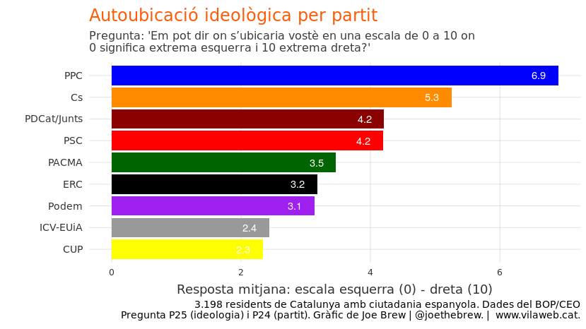

Els votants de la CUP es situen a l'esquerra, i els votants del PP es situen a la dreta. Cap sorpresa. Però sí que sorpren la ubicació del PSC relativa al PDCat. El PSC, que s'enorgulleix de ser un partit "d'esquerres" es situa a exactament la mateixa ubicació que el PDCat, a qui s'acusa amb freqüencia de ser un partit de "dretes". Curiòs.

N'hi ha que diuen l'autoubicació no és fiable, que els votants no saben situar-se correctament en una escala i per tant cal mirar el suport o rebuig a polítiques específiques. Jo no se. Però, per si tinguessin raó, fem-ho: mirem el grau de suport a polítiques i afirmacions que tenen un clar posicionament ideològic esquerra-dreta.

Grau d'acord amb afirmacions ideologicament situades
====================================================

En els gràfics següents es veuen uns patrons clars: el PPC i C's se situen normalment junts, and un grau d'acord (o desacord) consistent amb un posicionament ideològic de dretes, mentres la CUP, ERC i Podem se situen més a l'esquerra. Lo interessant, però, és la comparació entre el PDeCat i el PSC. En algunes mesures (intervenció estatal en l'economia), el PSC se situa clarament a l'esquerra del PDeCat, però en altres (mesures per a reduir la desigualtat), el PDeCat sembla més d'esquerres. En la majoria d'indicadors, el PDeCat i el PSC tenen un perfil ideològic gairebé igual. És a dir, si es considera que el PDeCat és "de dretes", el PSC també; i si el PSC és "d'esquerres", el PDeCat també.

Intervenció estatal i l'economia
--------------------------------

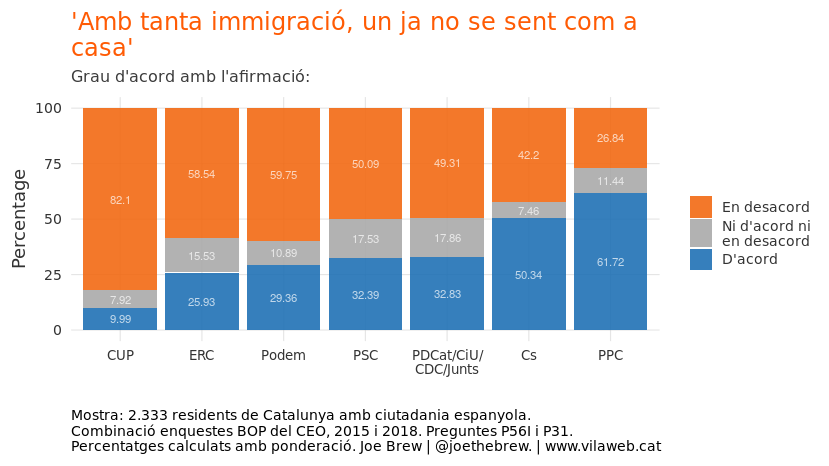

Impostos i prestacions públiques
--------------------------------

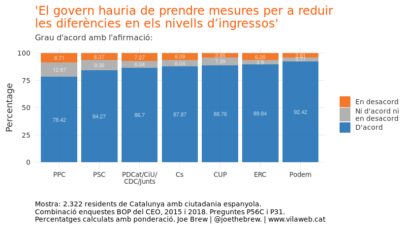

Desigualtat i intervenció estatal
---------------------------------

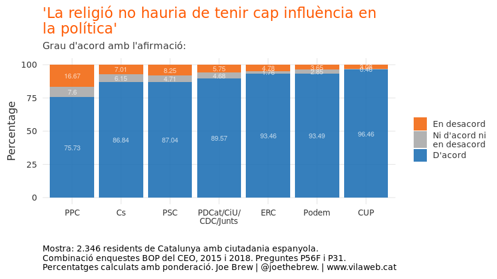

Drets dels homosexuals
----------------------

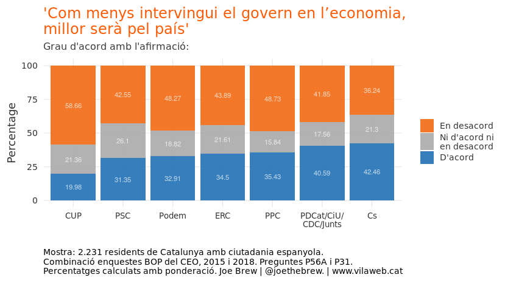

Obediència i autoritat
----------------------

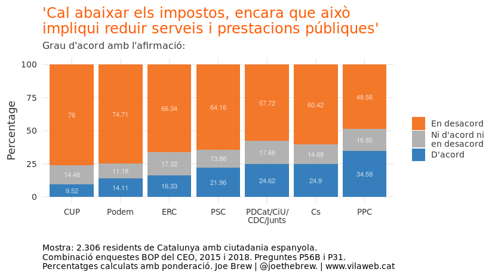

El paper de la religió en la política
-------------------------------------

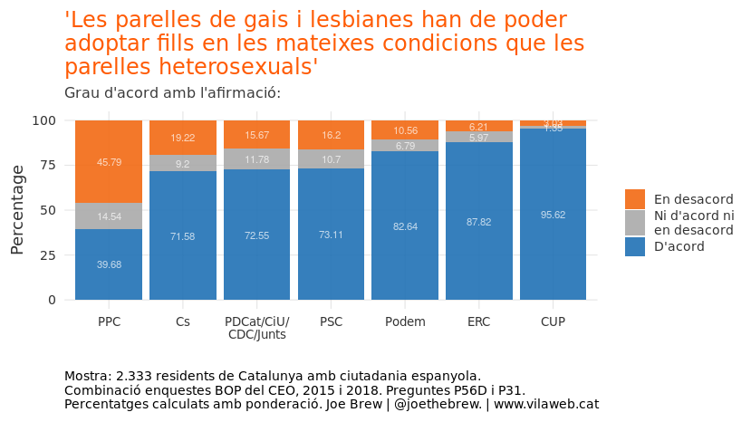

Obediència i llei
-----------------

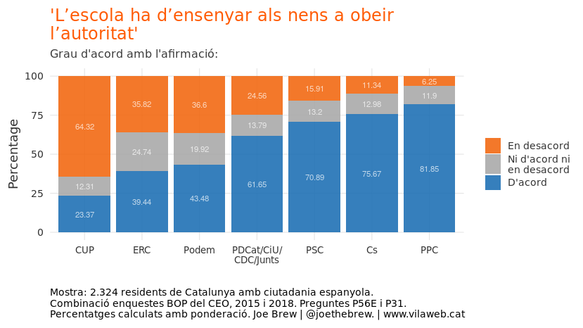

Eutanàsia
---------

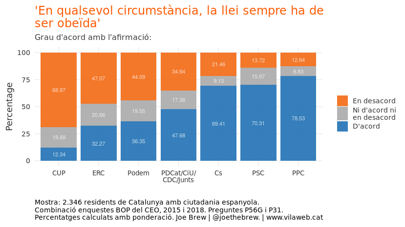

Immigració i xenofòbia
----------------------

Protecció del medi ambient i creixement econòmic
------------------------------------------------

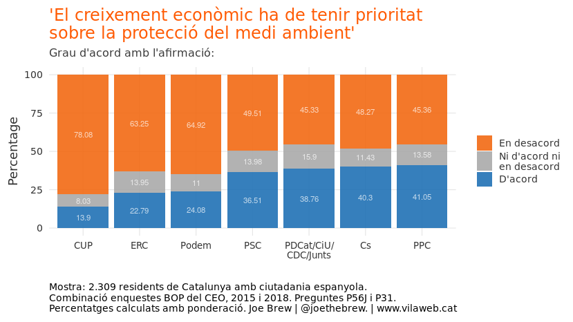

Valoració de polítics
=====================

Anem més enllà del suport per a polítiques específiques i l'autoubicació. Una altre manera de medir la posició en l'escala ideològica és a través de la valoració de polítics. No es útil la valoració dels polítics del seu propi partit (és normal que un votant del PP valora de manera positiva un polític del mateix partit, per exemple); però sí és util la valoració de polítics d'altres partits, que tenen un perfil ideològic clar. Anem-hi.

Valoració d'un polític d'esquerres
----------------------------------

Com valoren els votants de diferents partits la diputada dels Comuns, Jessica Albiach? Mirem-ho en el gràfic següent:

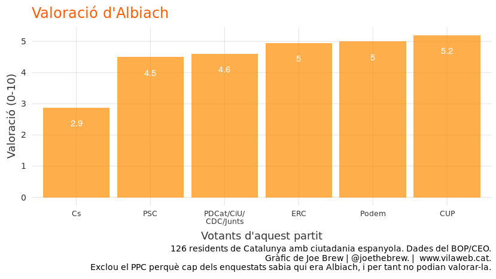

És clar que els votants de partits de dretes valoren de manera més negativa a Albiach, i els votants de partits d'esquerres la valoren de manera més positiva. Curiosament, el partit del lema "Som l'esquerra" la valora pitjor (però gairebé igual) que el partit "de dretes", PDeCat.

Valoració d'un polític de dretes
--------------------------------

Mirem la valoració d'un polític inqüestionablament de dretes: Mariano Rajoy.

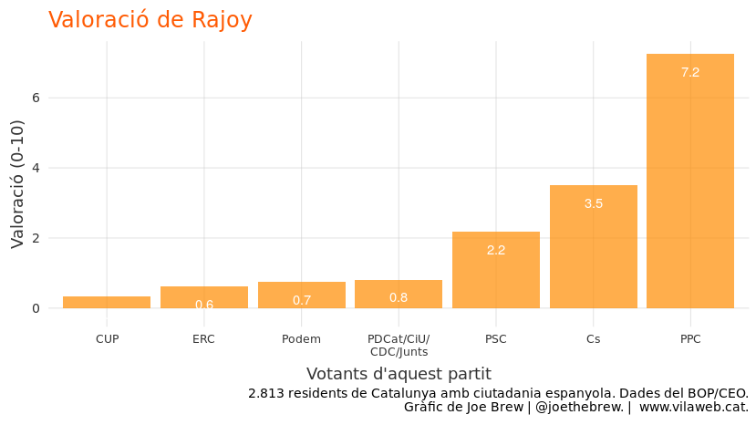

No cal fer cas a la valoració de Rajoy pels votants del PPC (els votants del propi partit sempre valoren de manera positiva). Però en el gràfic anterior es veu un patró clar: quan més a l'esquerra, més baixa la valoració de Rajoy. Lo curiós, una altre vegada, és que la valoració d'un polític de dretes és molt més alta entre els votants del PSC (suposadament "d'esquerres") que els votants del PDeCat (suposadament "de dretes").

Valoració d'un polític mort
---------------------------

Suposem que els gràfics anteriors no són fiables perquè la qüestió de la sobirania de Catalunya és massa omnipresent. És a dir, és credible que els votants del PSC són realment molt d'esquerres (i per tant, molt en contra de les polítiques de Rajoy), però que valoren de manera més positiva a Rajoy perquè aproben la seva gestió de Catalunya. I potser aquests mateixos votants del PSC valoren de manera relativaement negativa a Albiach perquè ella està al favor de la sobirania catalana.

Com poder evitar aquests possibles biaixos? Valorem un polític que té un posicionament ideològic clar (de dretes) que no és de la nostra época: Francisco Franco:

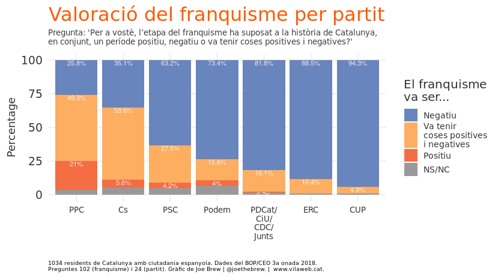

En el gràfic anterior, és clar que la probabilitat de pensar que el franquisme va ser "positiu" o va tenir "coses positives" és molt més alta entre partits de dretes (PP i C's) que partits d'esquerres (CUP, Podemos, etc.). Però una altre vegada trobem que els votants del PSC són més a la dreta que els votants del PDeCat: 31% dels votants del PSC diuen que el franquisme va ser positiu o va tenir coses positives, mentres només 16% dels votants del PDeCat ho diuen.

Conclusió
=========

Analitzant l'autoubicació, el grau d'acord amb polítiques, i la valoració de polítics, és clar que Catalunya té dos partits grans de dretes: el PP i C's. També és clar que té 3 partits clarament d'esquerres: CUP, ERC, i Podem. Però les dades demostren que la classificació freqüent del PSC com un partit "d'esquerres" i el PDeCat com un partit "de dretes" és simplement errònea. Els PSC i el PDeCAT ocupen el mateix espai polític a Catalunya: el centre. Amb l'excepció de la qüestió de l'autodeterminació, els votants dels dos partits comparteixen una ideologia política similar. Continuar assignant el PSC a l'esquerra i el PDeCat a la dreta reflecteix una ignòrancia de les dades objectives.
