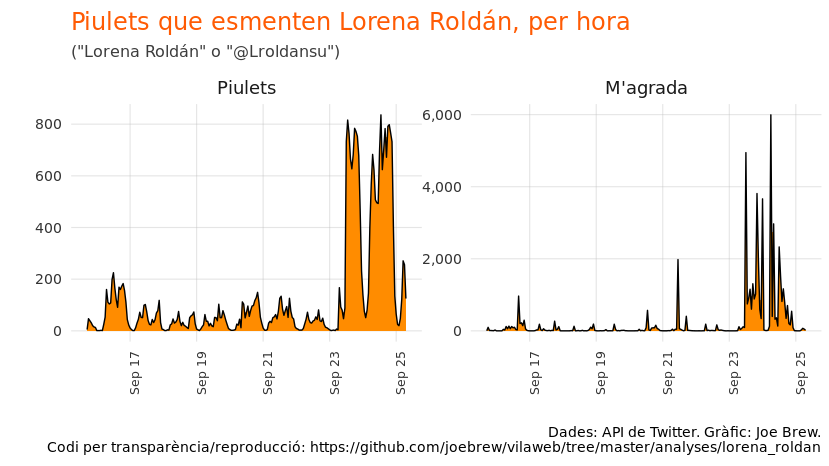

Ara tots sabem qui és Lorena Roldán
================

## La guerra per la cobertura mediàtica

P.T. Barnum, empresari americà i fundador del Circ Barnum & Bailey al
segle 19, va dir (suposadament) que “la mala publicitat no existeix”. O
sigui, lo important no és que diguin coses bones de tu, sinó que parlin
de tu.

La dita és igual d’aplicable al segle 21, i en relació a un altre circ:
la política. Una de les raons per la qual Donald Trump va guanyar les
eleccions presidencials als Estats Units en 2016 és que va ser, per
lluny, [el candidat que va rebre més atenció dels
mitjans](https://cyber.harvard.edu/publications/2017/08/mediacloud). La
cobertura no era gaire positiva, però el fet d’estar sempre sortint a
les notícies li va donar més capacitat per controlar el relat que
qualsevolr altre polític.

L’estratègia de Trump per fer que els mitjans només parlessin d’ell era
bastant senzilla: ser el candidat més provocatiu i exagerat, dient
constanment barbaritats tan notables que *no informar* sobre “el que va
dir avui el Donald Trump” semblaba periodísticament irresponsable. I
l’estratègia va funcionar. Es va convertir en el Sol de la política
amb tots els altres a la seva òrbita, havent de posicionar-se sempre en
relació a ell i a la seva barbaritat del día.

## L’estratègia de Trump i Ciutadans

El partit a l’estat espanyol que més ha sapigut capitalitzar
l’estratègia de Trump és Ciutadans. Per què fan servir en llenguatge
gairebe bel-lic
(“[comandos](https://twitter.com/joethebrew/status/1071506668897341440)”,
“[asaltos](https://twitter.com/joethebrew/status/1047759926129557504)”,
“katanas”) quan parlen de la política? Per què menyspreen els seus
adversaris polítics constanment amb paraules com “cabecilla”, “banda”,
“copista”, “trena”)? Per què van a municipis com Amer, Vic, Tortosa,
etc. on gairebé no tenen cap suport electoral? Per què van anar a
Waterloo?

La resposta és senzilla: perquè així fa que parlem d’ells. Quans de
nosaltres sabem on s’ha fet l’últim acte dels Comuns (no molts)? Però
gairebé tots estem al corrent dels actes de Ciutadans, de la mateixa
manera que al 2016 estaven tots els americans al corrent dels discursos
de Donald Trump. L’escàndol, l’hipèrbole i la crispació provoquen un
interès mòrbid entre les persones - no podem apartar la mirada.

## L’exemple més recent: Lorena Roldán, el detonador, i la Goma-2

Què sabem sobre les detencions que es van produir el dilluns a Catalunya
en una operació de 500 Guardia Civil? Casi res. Van entrar a cases de
les persones, les van detenir, van grabar una mica en un garatge, i les
van portar a Madrid.

Però a la tarda del dilluns, Lorena Roldán va fer un discurs el el qual
(a) vincula el President Quim Torra amb el terrorisme i (b) afirma que
[“a aquellos que tiene Goma-2, los Mossos d’Esquadra no les hacen
absolutamente
nada”](https://twitter.com/Mr_floG/status/1176104800997564416). Roldán
va recordar que Torra havia animat als activistes dels CDR a “apretar”,
afegint [“Qué era lo que tenían que apretar? ¿El detonador de estos
explosivos”](https://www.eldiario.es/politica/MINUTO-POLITICO-Errejon-Madrid-precampana_13_945385453_32867.html).

Per què fer un discurs tan inflamatori i tan poc basat en la evidència.
Per què esmentar “Goma-2”, si no n’havia? Per què intentar vincular un
rival polític amb el *terrorisme*?

Perquè la crispació, l’acusació sense fondaments, i l’hipèrbole fan que
la gent parli de tu, i davant els resultats decepcionadors de les
darreres eleccions i el fet que el seu nou líder a Catalunya és gairebé
desconeguda, Ciutadans necessita desesperadament que la gent parli
d’ella.

I ha funcionat.

El gràfic següent mostra els piulets, m’agrada, i repiulets per hora que
esmenten Lorena Roldán. La seva presència a les xarxes els darrers dos
dies és tremenda, sobre tot si es pren en compte el fet que només te
15.000 seguidors (compari amb el 175.000 de Quim Torra, els 520.000 de
Arrimadas, els 587.000 de Junqueras, o els 761.000 de Puigdemont).

<!-- -->

Nota que el gràfic anterior és per hora: o sigui, en el seu apogeu, la
freqüència de piulets esmentant Roldán va arribar a 800 per hora, o un
cada 4 segons. I els “m’agrada” a un ritme de més de 100 per minut

Mirem-ho per dia. En els dies previs al discurs del dilluns 23 de
setembre, la freqüència de piulets esmentant Roldán ja estava més alta
que normal deguda al fet que pocs dies abans (el 15 de setembre) havia
afirmat que la gent anava que la gent anava per la ciutat de Barcelona
amb “katanas”.

| date       | Piulets | M’agrada |
| :--------- | ------: | -------: |
| 2019-09-15 |     170 |      151 |
| 2019-09-16 |    2388 |     2696 |
| 2019-09-17 |    1066 |      868 |
| 2019-09-18 |     714 |      567 |
| 2019-09-19 |     841 |      336 |
| 2019-09-20 |    1470 |     1284 |
| 2019-09-21 |    1354 |     2724 |
| 2019-09-22 |     722 |      514 |
| 2019-09-23 |    8470 |    18745 |
| 2019-09-24 |   12201 |    22691 |

Abans del discurs del “detonador”, hi havia una mitjana de menys de
1.000 piulets per dia sobre Roldán. Però el discurs va provocar una
pujada de 1.000%: més de 8.000 piulets i 18.000 m’agradas el dilluns, i
encara més (12.000 i 22.000) l’endemà.

## Conclusió

La crispació paga. Tant a les xarxes (el focus d’aquest article) que als
mitjans, la manera més eficaç de fer que la gent parli de tu és
simplement dir coses absurdes. Que vincular terrorisme amb polítics
rivals, o Goma-2 amb persones que tenen dret a la presumpció d’inocència
pugui tenir efectes “col-laterals” per la societat sembla importar poc a
alguns polítics. A l’era de Trump, “l’exit” polític depen de la
capacitat de manipular els mitjans i les xarxes. En aquesta capacitat,
Roldán - com Trump - destaca.

# Technical details

The code for this analysis is publicly available at
<https://github.com/joebrew/vilaweb/tree/master/analyses/lorena_roldan>.
