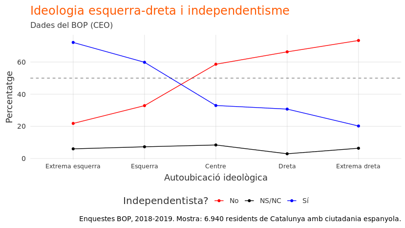
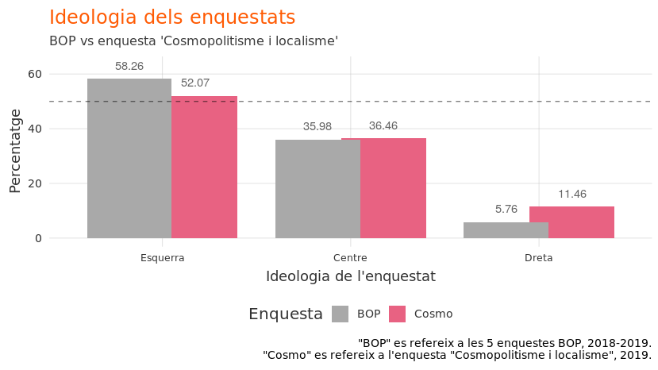
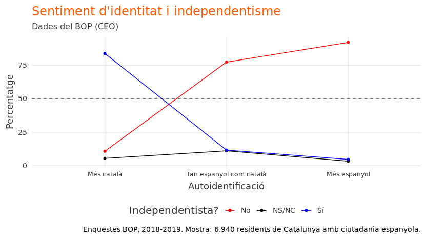
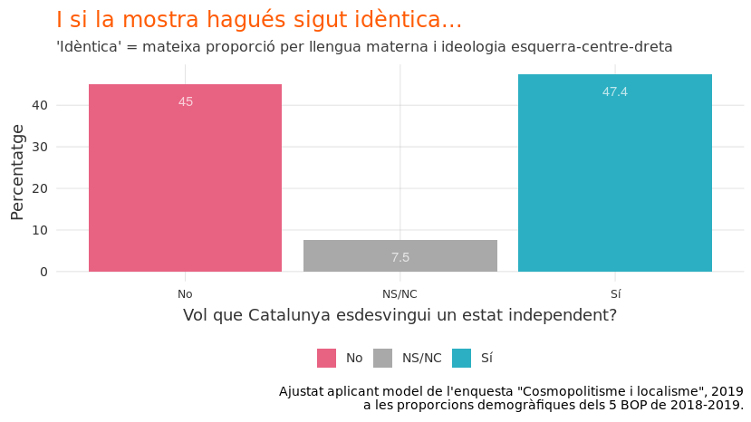

# 42? Si us plau, una mica de rigor

### La gran “noticia” de la setmana

Els resultats de la darrera enquesta publicada (“Enquesta:
Cosmopolitisme i localisme a Catalunya”) pel Centre d’Estudios d’Opinió
han dominat molts titulars aquests dies, tant al nivell de l’estat
espanyol que a Catalunya.

<table style="width:100%">

<tr>

<td>

</td>

<td>

</td>

</tr>

<tr>

<td>

</td>

<td>

</td>

</tr>

</table>

La notícia sembla rellevant, i el missatge és clar: l’independentisme
cau. “Se hunde”. Per visualitzar aquesta suposada caiguda, El País fins
i tot va publicar [en el seu article](%3Cimg%20src=%22img/4.png%22) un
gràfic comparant les respostes de la darrera enquesta amb les enquestes
del Baròmetre d’Opinió Pública (BOP) dels darrers anys.

Però hi ha un problema. Com diu el Roger Tugas, periodista de dades al
Nació Digital, en el seu [excel-lent
analisi](https://www.naciodigital.cat/noticia/191129/dades/ocultes/ceo/apunten/si/guanyaria/referendum)
del divendres: “Cal comparar dades comparables”. Les dades d’aquesta
darrera enquesta (“Cosmopolitisme i localisme a Catalunya”) son
comparables amb les del BOP?

La resposta és bastant clara: no. La mostra dels 1.500 enquestats de la
darrera enquesta, comparada amb la mostra “normal” del BOP (o sigui, la
suma dels 7.500 de les 5 enquestes BOP dels anys 2018 i 2019), és:

  - Més castellanoparlant
  - Més a la dreta política
  - Mes identitariament espanyol

Realment la societat catalana ha canviat tan lingüísticament,
socialment, identitariament, i políticament en uns mesos? Probablement
pas.

## Llengua

La llengua és intimament correlacionada amb l’independentisme. Per
exemple, en els anys 2018-2019, aquesta ha sigut la relació entre
llengua primera (la que es parlava a casa de petit) i suport a
l’independència de Catalunya:

<!-- -->

Que passaria en una enquesta, doncs, si es seleccionés a més persones de
llengua primera castellana (~30% independentista) i menys persones de
llengua materna catalana (~80% independentista)? Evidentment, pujaria en
els resultats el percentatge en contra de l’independència. I això és
exactament el que va passar. Mireme la llengua primera dels enquestats
BOP comparada amb les de l’enquesta cosmopolitana:

<!-- -->

Realment el percentatge de catalans de llengua materna castellana va
pujar 8% en els darrers mesos? Clar que no. La llengua primera no canvia
al llarg de la vida\! El que ha canviat és la mostra de l’enquesta.

## Eix ideològic

Tant les enquestes del BOP com l’enquesta “Cosmopolitisme i localisme”
pregunten sobre l’autoubicació ideològica dels enquestats en una escala
de 0 (extrema esquerra) a 10 (extrema dreta). Historicament, aquest eix
ideològic està molt correlacionat amb l’independentisme: com més
autoubicat a l’esquerra, més independentista. Per tant, si es
seleccionés a més gent de la dreta, els resultats reflectarian una
baixa de suport a l’independència - i és exactament el que va passar.

Mirem, primer, la relació històrica esquerra-dreta /
independentisme-unionisme:

<!-- -->

Però què va passar en l’enquesta “Cosmopolitisme i localisme”? El
percentatge de catalans que s’autoubiquen en la dreta política (6 o més
en l’escala de 0-10) va pujar significativament.

<!-- -->

Realment el percentatge de catalans que s’autoubiquen en la dreta
política va duplicar? Probablement pas. El més probable és que la
darrera enquesta va sobreamplificar de persones de la dreta política (el
que va tenir un impacte, logicament, en els resultats sobre
l’independentisme).

Mirem-ho d’una altra manera. El gràfic següent és l’autoubicació
ideològica dels enquestats al llarg del temps.

<!-- -->

Els catalans realment van fer un gir radical a la dreta ens els darrers
mesos? Poc probable.

## Identitat

L’identitat i les opinions sobre l’independència van també de la mà. Com
més autoidentificació espanyola, més unionista; com més
autoidentificació catalana, més independentista. Aquesta és la relació
independentisme i identitat, historicament:

<!-- -->

La gent canvia sovint d’identitat? No. Per tant, quan hi ha canvis
d’identiat signifactius en unes enquestes, el més probable no és que
la societat canvia, sinó que el mostreigos són diferents (i per tant,
incomparables). Si es selecciona per una enquesta més gent de sentiment
“català”, l’independentisme pujaria; de la mateixa manera, si es
seleccionés per una enquest més gent de sentiment “espanyol”,
l’independentisme apareixeria molt baix.

Què va passar en la darrera enquesta publicada pel CEO? Mirem-ho:

<!-- -->

Curiós, oi? Ens uns pocs mesos, el percentage de catalans que es
considera més català que espanyol realment va baixar 10%? Perdoneu les
repetcions, però no. Els sentiments identitaris canvien molt poc, i mai
de manera ràpida. Les diferències entre les enquestes BOP i l’enquesta
“Cosmopolitisme i localisme” no reflecteixen canvis en la societat
catalana, sinó canvis en un mostreig de 1.500 persones.

## I si la mostra no hagúes canviat…?

Intentem salvar les dades, o al menys ajustar-les de manera per què
siguin comparables al llarg del temps. Si acceptem com a fets que (a) la
llengua materna i l’ideològia (esquerra-dreta) són els factors
principals que determinen la posició d’algú sobre l’independència de
Catalunya i (b) que és molt, molt poc probable que les freqüències
d’aquestes variables hagin canviat significativament ens els darrers
anys, ens permet fer l’analisi següent: (i) crear un model estadístic
bàsic, basat en la darrera enquesta (“Cosmopolitisme i localisme”) on
l’independentisme és una funció de llengua + ideologia i després (ii)
aplicar aquest model a la mostra “normal” del BOP (o sigui, la
combinació de les 5 enquestes BOP de 2018-2019). Ho fem?

<!-- -->

Fent aquest ajust, l’independentisme seria al 47,4% mentres l’unionisme
seria al 45.

O (a) Catalunya ha canviat significativament en quant al seu perfil
ideologic i llengua materna o (b) la mostra de la darrera enquesta és
qualitativament diferent de la mostra dels BOP. En resum:
l’independentisme és, més o menys, igual que fa un any o dos.

## Conclusió

Les enquestes del CEO són molt útils precisament perquè, a diferència de
moltes enquestes publicades pels diaris, publiquen les microdades (el
que permet un analisi que va més enllà dels resultats “crus”). I
qualsevol comparació minimament rigurosa de les dades de l’enquesta de
“Cosmopolitisme i localisme” amb les dades del BOP hauria de prende ne
compte les diferències ideológiques i lingüístiques entre les mostres,
com que aquestes diferències poden determinar, en gran part, els suport
o rebuig a l’independentisme.

Un analisi de les dades de les BOP dels darrers anys i l’enquesta
“Cosmopolitisme i localisme” deixa clar que la darrera és esbiaixada
d’una manera que *sobrereflexiona* la dreta i els catalans d’origen
castellanoparlant mentres que *infravalora* l’esquerra i els
catalanoparlants, comparada amb els BOP. Això, logicament, té
conseqüències importants alora de calcular el suport a
l’independència. El 42% (el chifre que surt en els titulars de tots
els diaris) prové d’un analisi que ignora les característiques del
mostreig, i les seves conseqüències.

Quan es ponderen les dades per ajustar pels esbiaixos més importants
(llengua, lloc de naixement, i provincía), com [va fer el Roger
Tugas](https://www.naciodigital.cat/noticia/191129/dades/ocultes/ceo/apunten/si/guanyaria/referendum),
l’independentisme i l’unionisme estan a basicament el mateix nivell (45%
cadascú). O sigui, quan es tracta les dades d’una manera crítica, no
consta una baixada significativa en el suport a l’independència, sinó
uns moviments adins del marge d’error estadístic. Altrament dit, un
analisi rigorós de les dades d’aquesta enquesta porta a la mateixa
conclusió que un analisi de qualsevol de les enquestes dels darrers
anys: que el nivell de suport a l’independència no ha tingut canvis
significatius en els darrers anys.

Però clar, els conceptes “ponderació”, “esbiaix”, “sobrerepresentació”,
i “marge d’error” no fan bons titulars. 42%? Això sí que és un bon
titular. Així que prepareu-vos a sentir, una i altra vegada, aquest
chifre - fins que surti la propera enquesta (on hi haurà molt
probablament una suposada “pujada” en suport a l’indepèndencia només
degut al principi de “la regressió a la mitjana”).

# Technical details

The code for this analysis is publicly available at
<https://github.com/joebrew/vilaweb/tree/master/analyses/quarantaun>.
