Què pensen els catalans dels seus polítics?
================

Introducció
===========

Què pensen els catalans dels seus polítics? Per qui es senten representats? Com valoren "els seus"? Com valoren els polítics que "adversarials"? Fins quin punt influeix el partit o la ideologia política en l'aprobació dels polítics?

Mètodes
=======

Per a aquesta anàlisi, fem servir les dades del Baròmetre d'Opinió Política (BOP) del Centre d'Estudis d'Opinió (CEO). És, sense dubte, la millor font de dades polítiques al nivell català no només perquè es fa presencialment (la majoria de les enquestes contractades pels diaris es fa per telèfon, el que implica un biaix important en la mostra), sinó també perquè es publiquen totes les dades "en brut" (o sigui, les microdades). Aquesta transparència fa que els resultats siguin més fiables i també analitzables. Les dades i els detalls tècnics de la seva recollida són [aquí](http://ceo.gencat.cat/ca/barometre/detall/index.html?id=7008).

Analitzem els resultats de l'enquesta BOP, primera ronda 2019. Consisteix d'una mostra sistemàtica de 1500 catalans, amb les dades recollides en març (publicades en abril).

Resultats
=========

Reconeixement
-------------

Comencem pel reconeixement. El gràfic següent mostra, per cada polític principal, quin percentatge de catalans saben qui és.

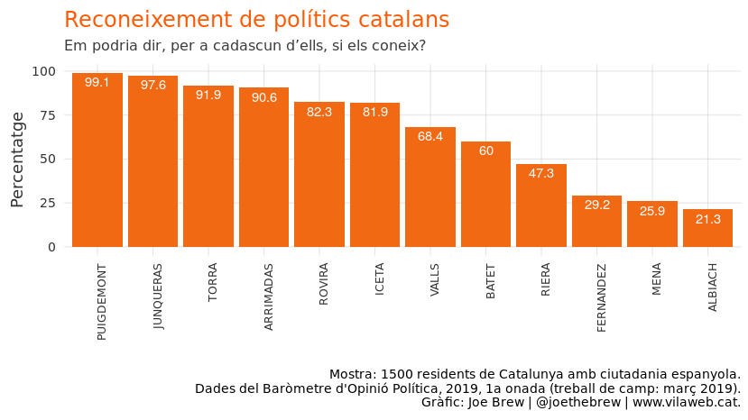

Puigdemont i Junqueras són els més coneguts - practicament tots els catalans saben qui són. 9 de cada 10 coneixen també Torra i Arrimadas.

Reconeixement per partit
------------------------

Podem examinar també el coneixement de polítics, agrupant per partit dels enquestats.

### C's

El gràfic següent mostra el coneixement de polítics catalans pels votants de Ciutadans. Coneixen més Puigdemont (100%), Junqueras (98,9%), i Torra (94,5%) que la cap de llista del seu propi partit, Inés Arrimadas (93,4%). Menys de 2 de cada 3 votants de C's saben qui és Manuel Valls (el seu candidat no oficial per l'alcaldía de Barcelona).

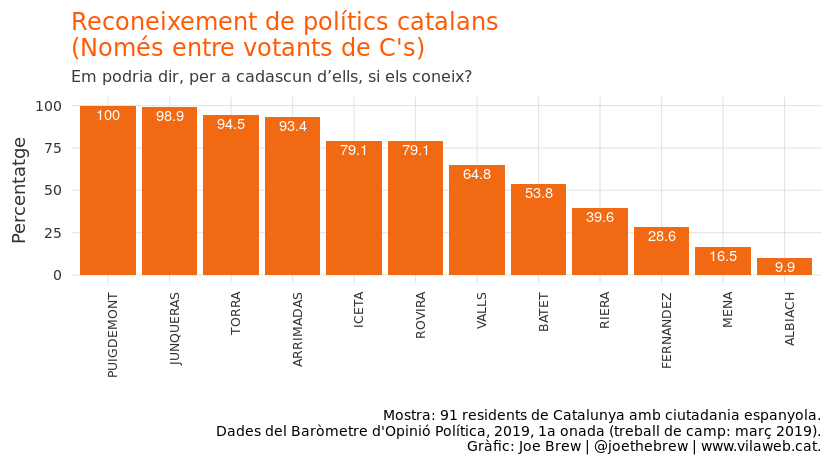

### Catalunya en Comú-Podem

El gràfic següent mostra el coneixement de polítics catalans pels votants de CECP Com el cas de Ciutadans, la gran majoria coneixen als principals liders independentistes. Però menys de la meitat dels votants de CECP saben qui són els polítics del seu propi partit (Jessica Albiach i el aliat Joan Mena).

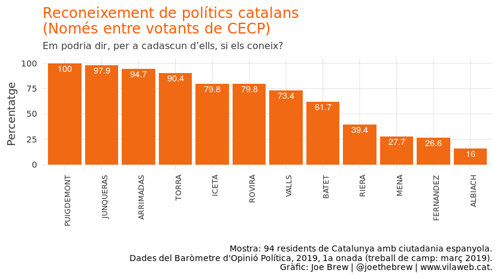

### La CUP

El gràfic següent mostra el coneixement de polítics catalans pels votants de la CUP. Com tots els altres partits, saben qui són els principals liders sobiranistes, i la Inés Arrimadas. Però a diferència de Podem, la majoria dels votants de la CUP sí que saben qui és el seu principal representant al Parlament (Carles Riera).

### ERC

El gràfic següent mostra el coneixement de polítics catalans pels votants de Esquerra Republicana. Tots coneixen el seu lider (Junqueras) i el Puigdemont, i la gran majoria (93,1%) també coneixen la Marta Rovira (qui és a l'exili a Suissa).

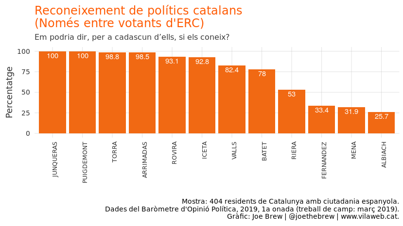

### Junts per Catalunya

El gràfic següent mostra el coneixement de polítics catalans pels votants de Junts per Catalunya. Tots coneixen Puigdemont, i practicament tots coneixen Torra. Però només una minoria saben qui són els representants del PPC (Alejandro Fernández) i de Podem/EUiA.

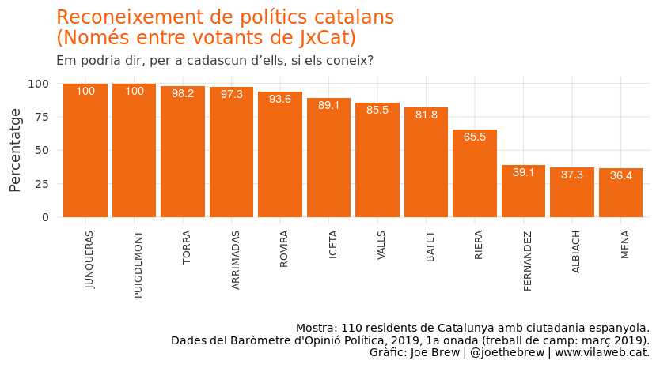

### PPC

El gràfic següent mostra el coneixement de polítics catalans pels votants del Partit Popular. N'hi ha pocs (només 18 dels 1500 enquestats) i per tant la mostra és poc "generalitzable". Però en aquesta mostra petita de 18 votants del PP, només 1 (5,6%) sabia qui era Alejandro Fernández (el principal representant del seu partit al Parlament). Tots, però, sabien qui era Puigdemont.

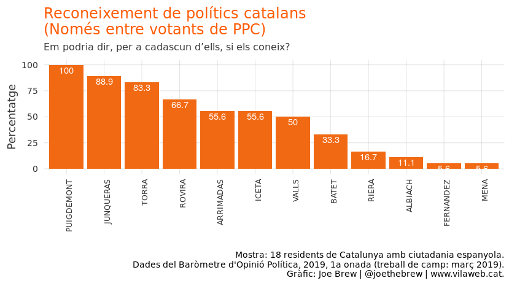

### PSC

El gràfic següent mostra el coneixement de polítics catalans pels votants socialistes. Segueixen, més o menys, el mateix patró que els altres partits (alt reconeixement de Puigdemont i Junqueras, baix de Fernández, Mena, Albiach, etc.). El que sorpren és el coneixement relativament baix del seu lider, Miquel Iceta (84,9%) i de la Meritxell Batet (55,8%, Ministre del Govern Socialista de Pedro Sánchez).

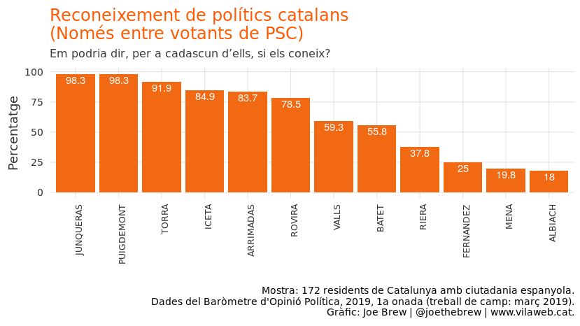

Valoració
=========

Més interessant que el coneixement (si els catalans saben qui és un polític) és la valoració (que pensen d'aquest polític). Anem-hi.

El gràfic següent mostra la valoració mitjana dels polítics per tots els catalans. En general, els polítics d'esquerres són ben valorats, i els de dretes, malament. Els polítics més ben valorats és troben a la presó i a l'exili (Oriol Junqueras i Marta Rovira, respectivament).

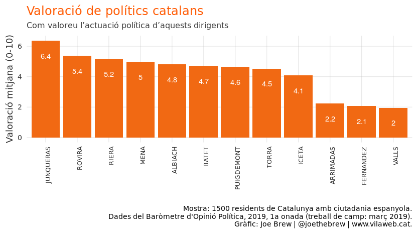

Valoració per ideologia política de l'enquestat
-----------------------------------------------

La valoració mitjana amaga un factor important: l'ideologia de l'enquestat. Com veiem en el pròxim gràfic, la valoració de cada polític varia bastant segons la ideologia política de l'enquestat.

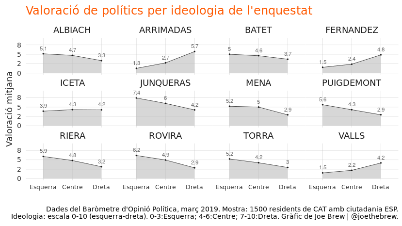

Els votants de dreta valoren molt més positivament a Fernández, Arrimadas i Valls que els votants d'esquerra. Els votants d'esquerra valoren molt millor a Albiach, Batet, Junqueras, Mena, Puigdemont, Riera, Rovira, i Torra. Iceta rep una valoració similar dels votants d'esquerres i de dretes.

La bretxa entre les valoracions dels votants d'esquerra i de dreta és més grant per la Inés Arrimadas. Els votants de dretes li posen una valoració altíssima (5,7), mentres els d'esquerres li posen una valoració baixíssima (1,3). Aquesta bretxa és curiosa per una persona el partit del qual aspira a ser "centrista".

També és curiós que els dos polítics del partit catalanista "de dretes" (el PDeCat: Quim Torra i Carles Puigdemont) són millor valorats pels votants d'esquerres que els de dretes.

Valoració de polítics per independentisme de l'enquestat
--------------------------------------------------------

Mirem el mateix, aquesta vegada substituent la ideologia esquerra-dreta per l'independentisme.

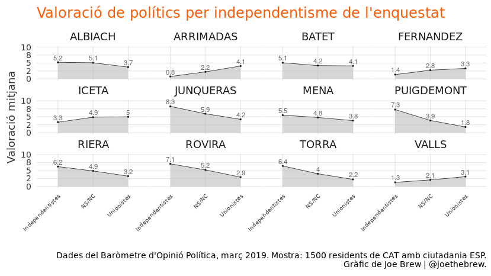

El patró és el mateix. Però dos coses sorprenen. Primer, Oriol Junqueras rep una valoració bastant alta fins i tot dels unionistes (4,2), el doble que la valoració que aquest bloc posa al Quim Torra o al Carles Puigdemont. Segon, els independentistes valoren bastant positivament a Jessica Abliach i Joan Mena (encara que no siguin independentistes).

Valoració de polítics per partit polític de l'enquestat
-------------------------------------------------------

Ara mirem la valoració dels polítics per partit de l'enquestat.

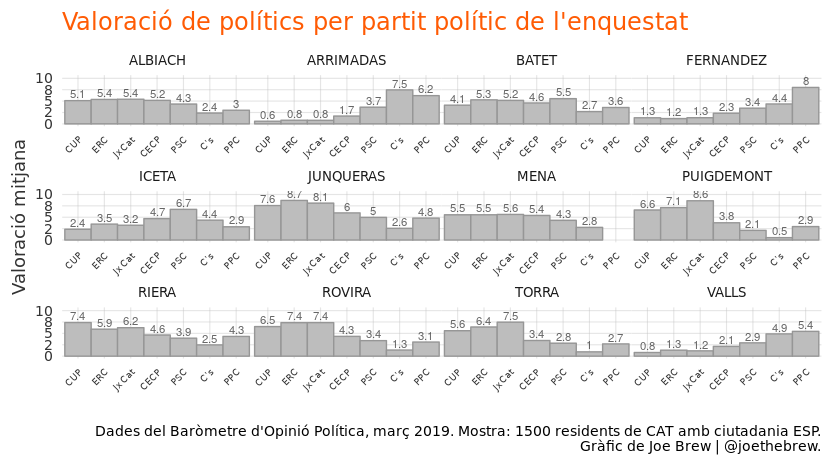

En el gràfic anterior, cal destacar 3 coses. Primer, Manuel Valls (socialista a França, aliat amb C's a Catalunya) és valorat millor pels votants del PP que qualsevol altre partit. Segon, Inés Arrimadas rep una valoració altíssima dels votants del PP (més alta, per exemple, que la valoració mitjana que els socialistes posen a Meritxell Batet). Tercer, els únics que reben valoracions molt altes (7+) de membres d'altres partits són Junqueras, Puigdemont, i Rovira (tots tres a la presó o a l'exili).

Valoració de polítics per llengua de l'enquestat
------------------------------------------------

La llengua considerada "pròpia" també influeix en la valoració dels polítics.

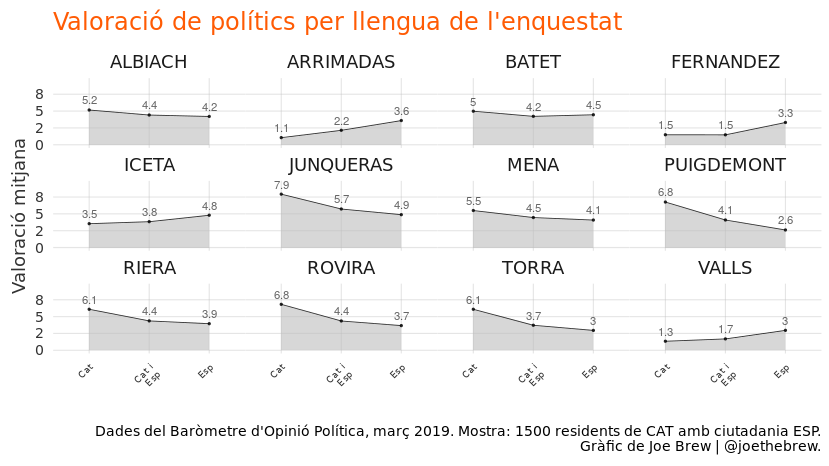

En general, els polítics que parlen més en català reben valoracions altes dels catalanoparlants; i els que parlen més en castellà reben valoracions altes dels castellanoparlants. L'excepció és el Miquel Iceta, que parla més sovint en català però rep una valoració baixa per part dels parlants del català.

Conclusió i reflexió personal
=============================

En general, els catalans valoren de manera bastant negativa els seus polítics. Dels 12 polítics principals, només 4 són "aprobats" pels votants; els altres 8 "suspenen".

En la política catalana s'acusa freqüentment a l'adversari polític de "només representar a la meitat de Catalunya". Ironicament, aquesta acusació vé més sovint dels polítics que reben valoracions més baixes de "l'altre meitat". Les dades demostren els que polítics de dretes (Arrimadas, Fernández, i Valls) són els que reben les pitjors valoracions dels votants de "l'altre banda" (d'esquerres). I els polítics unionistes reben pitjors valoracions dels independentistes que els polítics independentistes dels votants unionistes. O sigui, cap polític és "tranversal" en els eixos llengua, ideologia, independentisme, però els "menys" tranversals són els que més freqüentment acusen els altres de no ser-ho.

Details
=======

El codi per la reproducció d'aquesta anàlitsi està publicament disponible a <https://github.com/joebrew/vilaweb/tree/master/analyses/que_pensen_dels_politics>.
