Jordi Cuixart
================

-   [Summary](#summary)
    -   [The question](#the-question)
    -   [The methods](#the-methods)
    -   [The hypothesis of guilt](#the-hypothesis-of-guilt)
    -   [The results](#the-results)
    -   [Conclusion](#conclusion)
-   [Analysis](#analysis)
    -   [Finding 1: Twitter data does not indicate violence.](#finding-1-twitter-data-does-not-indicate-violence.)
    -   [Finding 2: Wikipedia and Google data do not indicate violence](#finding-2-wikipedia-and-google-data-do-not-indicate-violence)
    -   [Finding 3: Newspaper data does not indicate violence](#finding-3-newspaper-data-does-not-indicate-violence)
-   [Conclusion](#conclusion-1)
-   [Appendix](#appendix)

Summary
=======

### The question

Did Jordi Cuixart organize a public and violent uprising against the Spanish State?

### The methods

We explore organically generated data from twitter, google, wikipedia, and newspapers to try to answer the above question.

### The hypothesis of guilt

If Jordi Cuixart committed a public and violent uprising, we expect the following three conditions to be true:

1.  **We expect that social media chatter (number of tweets)** mentioning violence and/or Jordi Cuixart, particularly from the ideological adversaries of Cuixart (politicians opposed to Catalan independence) will be highest in the immediate aftermath of the violence. By the same token, his entry into prison will not be surprising (given the severity of the acts committed), and should therefore generate relatively less tweets than the acts themselves.

2.  **We expect that wikipedia page views and google searches** about Cuixart will be highest in the immediate aftermath of the violence. By the same token, his enty into prison will not be surprising (given the severity of the violent acts committed), and should therefore generate relatively less searches and page views than immediately following the violent acts themselves.

3.  **We expect that newspaper's tweets** about Cuixart will be hightest in the immediate aftermath of the violence, since a violent uprising is a very "newsworthy" event. Given the severity of the events, his entry into prison should be unsurprising, and therefore should generate less news coverage than the violent events.

### The results

1.  Hypothesis 1: REJECTED. Social media chatter about violence and Cuixart does not peak immediately after the supposed violent uprising, but rather after the entry into prison.

2.  Hypothesis 2: REJECTED. Wikipedia page views and google searches about Cuixart do not peak immediately after the supposed violent uprising, but rather after the entry into prison.

3.  Hypothesis 3: REJECTED. Newspaper coverage about Cuixart does not peak immediately after the supposed violent uprising, but rather after the entry into prison.

### Conclusion

A public and violent uprising, were it to have taken place, would be a major, attention-worthy event. In the case of Jordi Cuixart, however, attention from social media, wikipedia, search engines, and traditional Spanish and international media did not follow the pattern of a truly violent event.

Rather, online attention to Cuixart peaked with the Judiciary's decision to imprison him. In other words, *imprisoning Cuixart was considered more attention-worthy and/or surprising than his supposed crime.* This is inconsistent with an act as severe as rebellion - given the severity of the supposed act, we would reasonably expect the greatest amount of media chatter to take place immediately afterwards, not a month later. Also, given the severity of the act, we would expect the imprisonment of the act's author to be only a minor newsworthy event. Both of these expectations are refuted by the data.

The data regarding the events of September/October 2017 are not consistent with a violent crime. The fact that Mr. Cuixart's imprisonment garnered more attention than his supposed actions are also not suggestive of a violent crime, but rather of disproportionate imprisonment.

Analysis
========

Finding 1: Twitter data does not indicate violence.
---------------------------------------------------

### A.

*Social media chatter about violence and Jordi Cuixart, even when limited to the ideological adversaries of Cuixart (politicians opposed to Catalan independence) does not peak in the immediate days following the supposed crime.*

We harvested tweets from 23 well-known Spanish/Catalan politicians and political parties/groups during the supposed violent uprising organized by Cuixart (September 20th, 2017), as well as the following 2 days (September 21, 2017 and September 22nd, 2017). The list of the 23 politicians was intentionally made up of politicians who are known to be against the independence of Catalonia. The 23 are listed below:

    albert_rivera
    albiol_xg
    alevysoler
    carrizosacarlos
    ciudadanoscs
    ciutadanscs
    eva_granados
    inesarrimadas
    j_zaragoza_
    marianorajoy
    meritxell_batet
    miqueliceta
    pablo_iglesias_
    pablocasado_
    pnique
    ppcatalunya
    ppopular
    psoe
    sanchezcastejon
    santi_abascal
    socialistes_cat
    societatcc
    vox_es

During the 3 days analyzed (Sep 20-22, 2017), the 23 accounts generated 939 tweets.

Of these 939 tweets:

-   0 mentioned the name of Cuixart.

-   0 mentioned the "Jordis".

-   0 mentioned "Omnium".

-   0 mentioned "uprising" (alzamiento), "rise up" (alzar), etc.

-   0 mentioned "tumultuous" (tumultuoso, tumultuosamente) behavior or "tumults" (tumultos), etc.

-   3 mentioned "violence", "violent", etc. But none of these tweets mentioning violence were in reference to Cuixart or the events for which he is charged; rather, they were about gender violence, individual violence, and an assault unrelated to the protsts organized by Cuixart. These 3 tweets are below:

| date       | time     | username    | tweet                                                                                                                                                                                                    |
|:-----------|:---------|:------------|:---------------------------------------------------------------------------------------------------------------------------------------------------------------------------------------------------------|
| 2017-09-20 | 13:53:39 | albiol\_xg  | Todo mi apoyo y el del @PPCatalunya a @socialistes\_cat por el acto de violencia contra vuestra sede. Hoy todos los demócratas somos uno. <https://twitter.com/pscbarcelona/status/910462033560244225> … |
| 2017-09-22 | 23:38:56 | miqueliceta | Condemno sempre tota violència i tota mostra d’intolerància. I m’agrada que tothom ho faci sempre sigui qui sigui la víctima o l’agressor                                                                |
| 2017-09-21 | 09:38:03 | psoe        | 🔴@CristinaNarbona Queremos erradicar de una vez por todas la lacra de la \#violenciadegénero y mentalidad de un modelo patriarcal \#NarbonaFE                                                            |

-   7 of the 939 mentioned the supposed crimes for which Mr. Cuixart is being charged ("rebellion", "rebel", "sedition", "seditious", etc). However, none of these referenced Cuixart. And only one of referenced the protests which he helped to organize - but that one tweet (issued by Societat Civil Catalana) did not actually talk about the events in question, but rather about la Fiscalía's reaction to them. The 4 are below.

| date       | time     | username          | tweet                                                                                                                                                                                                                                                  |
|:-----------|:---------|:------------------|:-------------------------------------------------------------------------------------------------------------------------------------------------------------------------------------------------------------------------------------------------------|
| 2017-09-21 | 20:47:51 | albert\_rivera    | Nos han intentado callar muchas veces. Pero cada vez somos más los que nos rebelamos frente a la amenaza separatista \#NoNosCallarán pic.twitter.com/ghIyotPeym                                                                                        |
| 2017-09-21 | 18:55:30 | pablo\_iglesias\_ | Frente a la injusticia, construir la rebeldía es construir la democracia. Nos vemos este sábado en Alcorcón 👇 pic.twitter.com/JX6FRyJTte                                                                                                               |
| 2017-09-20 | 12:47:58 | santi\_abascal    | Si Puigdemont no es detenido hoy mismo después de su llamamiento esta misma mañana a la rebeldía y la sedición...quizá ya no lo sea nunca                                                                                                              |
| 2017-09-21 | 22:17:00 | santi\_abascal    | Hay 1 fórmula para q el capo del golpe deje de anunciar los pasos de la sedición.Y la sabemos todos: esposar al capo <http://www.elperiodico.com/es/amp/noticias/politica/puigdemont-anuncia-donde-votar-referendum-independencia-catalunya-6302010> … |
| 2017-09-22 | 12:47:01 | santi\_abascal    | Curas golpistas y adoradores de la estelada de oro. De todo hay en la viña del Señor. <http://www.abc.es/espana/abci-trescientos-curas-independentistas-llaman-catalanes-rebelarse-contra-estado-201709220957_noticia_amp.html> …                      |
| 2017-09-21 | 13:14:37 | societatcc        | La Guardia Civil atribuye al 'número dos' de Junqueras "sedición" por el referéndum <http://m.huffingtonpost.es/2017/09/21/la-guardia-civil-atribuye-al-numero-dos-de-junqueras-sedicion-por-el-referendum_a_23217691/> …                              |
| 2017-09-22 | 16:49:27 | societatcc        | La Fiscalía señala a la ANC y a Òmnium en su denuncia por sedición en los disturbios de Barcelona <https://goo.gl/QormNF>                                                                                                                              |

In other words, despite more than 1,000 tweets in the 3 day period from these politicians - who are all very critical of Mr. Cuixart's policy aims - none of them mentioned him participating in, organizing, promoting, or carrying out any violent acts. The only mention of a potential crime related to Cuixart is a news story about the Fiscalía, not about the actual violence in any events which occurred. If there was a violent rebellion, why did none of these politicians mention it?

### B.

*During actual violent events, the use of the words "violent" or "violence" corresponds closely with the actual occurrence of violent events.*

The below shows tweets with any word containing the stem "violen" (ie, "violencia", "violento", "violenta", etc.) from the same group of politicians during the period immediately before and after the events for which Mr. Cuixart is being criminally charged. It is clear that there is no significant increase in chatter about violence on or immediately after the dates of the supposed violence.

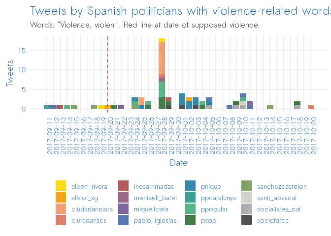

(The September 28th peak is largely due to tweets about an agreement on gender violence.)

Compare the above with the frequency of these words (in English) during a truly violent event. In August 2017, violent protests took place in Charlottesville, South Carolina (USA). White supremacists marched, and many counter-protestors also convened. There were violent clashes between the two groups and on August 12th a man drove his car into a crowd, killing one person.

The below shows the frequency of words with the root "violen" ("violence", "violent", etc.) from a random sample of US politicians (congressmen). The congressmen are listed below:

    amyklobuchar
    boblatta
    cathymcmorris
    daveloebsack
    davereichert
    farenthold
    gracenapolitano
    jahimes
    janschakowsky
    jasoninthehouse
    justinamash
    keithellison
    lisamurkowski
    louiseslaughter
    lutherstrange
    maziehirono
    michaelcburgess
    nikiinthehouse
    rep_stevewomack
    repblumenauer
    repcleaver
    repdavidkustoff
    repdavidscott
    repdonyoung
    repgregwalden
    repjohnlewis
    repmarkpocan
    reppittenger
    repsandylevin
    rosadelauro
    sendavidperdue
    senorrinhatch
    senrobportman
    teammoulton

Note that, unlike in the previous chart, the peak in violence-related chatter corresponds perfectly with the actual date of violent events.

When true violence occurs, politicians notice. And they tweet about it immediately. Why did none of these politicians tweet about the violence carried out by Mr. Cuixart in the immediate days afterwards?

### C.

*Social media chatter about Cuixart was much higher at the time of the entry into prison than at the time of the supposed violent events.*

The below shows tweets from the same group of politicians mentioning the name of Mr. Cuixart.

Clearly, despite him carrying out a rebellion, none of the politicians in question even tweeted his name. Not once. How is it that Mr. Cuixart was able to carry out a "public" and "violent" uprising without any politicians noticing?

Finding 2: Wikipedia and Google data do not indicate violence
-------------------------------------------------------------

### A.

*Wikipedia data about Cuixart does not peak immediately after the supposed violent uprising, but rather after the entry into prison.*

In the case of public, violent events, citizens react by searching for information on the perpetrators of the violence. They use search engines (google) and online encyclopedias (wikipedia) to learn more about the criminals.

The below chart shows all wikipedia page views for Jordi Cuixart and Jordi Sànchez in the period immeidately prior to and after the supposed violent uprising. Note that the major increase in views does not come at the time of the events in question, but rather around October 16th - when they are placed in preventive prison.

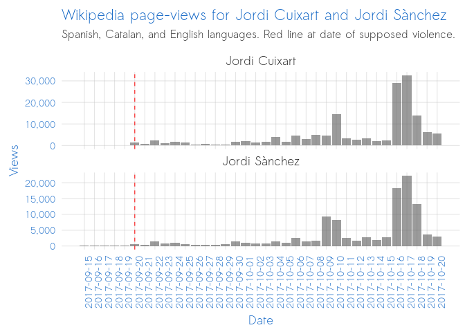

In other words, the public did not find the events of September 20-21 to be sufficiently noteworthy to merit much attention. However, they did find the events of October 16 to be notworthy. In other words, there appears to be more interest/surprise in the judicial process than in the actual events for which the judicial process is based.

### B.

*Wikipedia page views for the organizers of truly violent events increase rapidly in the period immediately after the violence.*

Contrast the above with the below chart, showing wikipedia page-views for the organizers of the violent Charlottesville protests in August 2017.

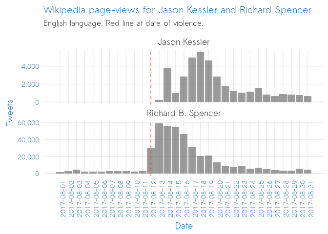

In the above chart, the correlation between acts of violence and interest in the organizers of the violent events is very tight. Acts of violence took place on August 12th, and interest in the organizers peaked in the immediate days following these acts of violence. This is significantly different from the interest profile for Mr. Cuixart.

### C.

*The frequency of Google serches for Cuixart does not peak immediately after the supposed violent uprising, but rather after the entry into prison.*

Google is much more frequently used than Wikipedia, and therefore offers a larger sample. The below shows *weekly* searches for Jordi Cuixart (as a percentage relative to the max interest). The date on the x axis reflects the last day in the week in question.

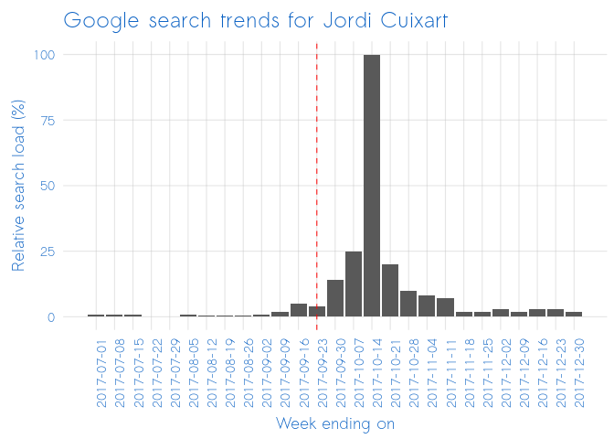

During the week of the supposed uprising, interest in Cuixart was only 4% of the interest during the week of his entry into prison. How could it be that he carried out a violent uprising, but the public did not find him sufficiently interesting to google him?

Incidentally, the interest curve for Jordi Sànchez is very similar. Clearly, the public did not find the events of Sep 20-21 to be sufficiently concerning or worrying to merit much attention.

### D.

*Google searches for the organizers of truly violent events increase rapidly in the period immediately after the violence.*

Contrast the above - a case of the public being more interested in judicial events than a supposedly violent uprising - with the below (a case of genuine interest in real violent events).

Interest for Jason Kessler, one of the organizers of the Charlottesville protest, peaked during the violence.

By the same token, interest for Richard Spencer, another of the organizers, peaked during the violence.

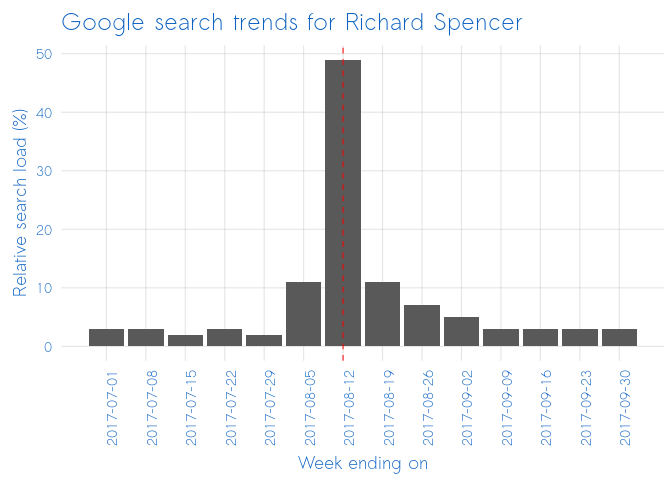

The interest curves in the above charts are markedly different for Jordi Cuixart and Jordi Sànchez compared with Jason Kessler and Richard Spencer. In the case of the former two, the events which they organized garnered very little attention from the public. Apparently, the public did not find their events to be interesting, concerning, or newsworthy. On the other hand, interest in the organizers of the Charlottesville protest coincided with the protest themselves. The violence of the protest motivated the public to carry out more searches.

The different in these curves suggests a significant difference in the reality of the events they reflect. The curves for Kessler and Spencer are suggestive of real violence. The curves for Cuixart and Sànchez are not.

Finding 3: Newspaper data does not indicate violence
----------------------------------------------------

### A.

*Newspaper coverage about Cuixart does not peak immediately after the supposed violent uprising, but rather after the entry into prison.*

We harvested tweets for 8 Spanish newspapers. We intentionally restricted our analysis only to those newspapers with a known anti-independence editorial position, so as to increase the likelihood of finding a "signal" in the "noise". The newspapers are listed below:

    cronicaglobal
    elconfidencial
    elespanolcom
    elmundoespana
    elpais_espana
    elperiodico
    lavanguardia
    okdiario

As a comparison, we also harvested tweets for 24 international newspapers, listed below:

    ajenglish
    BBC
    BBCWorld
    cnn
    cnnbrk
    cnni
    euronews
    financialtimes
    foreignpolicy
    foxnews
    ft
    guardian
    irishtimes
    lemondefr
    msnbc
    nbcnews
    Newsweek
    nytimes
    nytimesworld
    politico
    politicoeurope
    theeconomist
    time
    washingtonpost

The below chart shows the use of the words "violent" and "violence" in tweets from the Spanish newspapers. The vertical red line shows the date of the supposed violent uprising organized by Jordi Cuixart and Jordi Sànchez.

Clearly, there is no peak in tweets about violence during or after the events for which Mr. Cuixart is being charged.

We can restrict the analysis further by showing only tweets which contained a violence-related term (violent or violence) AND a mention of Spain, Barcelona, or Catalonia. The below shows this filtering. Again, the mentions of violence are much higher on other dates than on the dates immediately after the protest for which Cuixart is being charged.

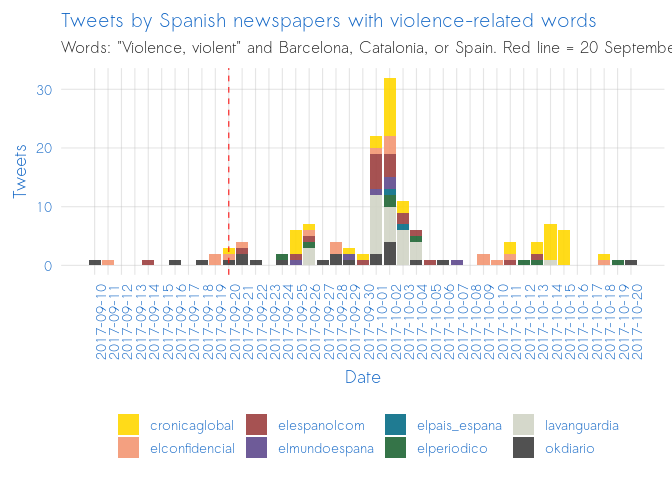

Furthermore, of the only 8 tweets actually mentioning violence during the 3 day period from Sep 20-22, none specifically reference Cuixart or his protest.

These tweets are shown below.

| date       | time     | username       | tweet                                                                                                                                                                                                                                                                                                                                      |
|:-----------|:---------|:---------------|:-------------------------------------------------------------------------------------------------------------------------------------------------------------------------------------------------------------------------------------------------------------------------------------------------------------------------------------------|
| 2017-09-20 | 10:05:20 | cronicaglobal  | El diputado de @Esquerra\_ERC, @JoanTarda, frente a la Consejería de Economía: "Quieren que haya violencia; no habrá" <https://cronicaglobal.elespanol.com/politica/guardia-civil-referendum_50_126.html> … pic.twitter.com/9w1aFXsWwS                                                                                                     |
| 2017-09-21 | 20:06:00 | elespanolcom   | Violencia en Cataluña: los cinco mayores ataques a la Guardia Civil este año <https://www.elespanol.com/espana/20170921/248475605_0.html> … pic.twitter.com/VRJT58JIYE                                                                                                                                                                     |
| 2017-09-21 | 18:24:02 | elconfidencial | Catalá acusa a Forcadell y a los que quieren un Estado catalán de “violentar” la independencia de los jueces <https://www.elconfidencial.com/espana/2017-09-21/referendum-cataluna-catala-acusa-forcadell-independentistas-violentar-independencia-jueces_1447719/?utm_source=twitter&utm_medium=social&utm_campaign=ECDiarioManual> …     |
| 2017-09-20 | 18:55:00 | elconfidencial | En Madrid repuntan los episodios violentos en fiestas con solo 30 antidisturbios disponibles. El resto, en Barcelona <https://www.elconfidencial.com/espana/madrid/2017-09-20/proces-cataluna-altercados-fiestas-madrid_1446269/?utm_source=twitter&utm_medium=social&utm_campaign=ECDiarioManual> …                                       |
| 2017-09-22 | 21:25:22 | okdiario       | La Fiscalía prepara una causa por sedición tras los violentos incidentes contra la Guardia Civil <https://okdiario.com/espana/cataluna/2017/09/22/fiscalia-prepara-causa-sedicion-incidentes-violentos-contra-guardia-civil-1345221?utm_term=Autofeed&utm_campaign=ok&utm_medium=Social&utm_source=Twitter#link_time=1506081641> …         |
| 2017-09-21 | 21:14:29 | okdiario       | Felipe VI intensifica los contactos con Rajoy ante la violencia independentista en Cataluña <https://okdiario.com/espana/2017/09/21/felipe-vi-intensifica-contactos-rajoy-violencia-independentista-cataluna-1343399?utm_term=Autofeed&utm_campaign=ok&utm_medium=Social&utm_source=Twitter#link_time=1506020047> …                        |
| 2017-09-21 | 20:56:49 | okdiario       | Catalá sobre los que se concentran ante el TSJC: “Quieren violentar la independencia de los jueces” <https://okdiario.com/espana/cataluna/2017/09/21/catala-concentran-tsjc-quieren-violentar-independencia-jueces-1343494?utm_term=Autofeed&utm_campaign=ok&utm_medium=Social&utm_source=Twitter#link_time=1506017433> …                  |
| 2017-09-20 | 21:55:00 | okdiario       | Tardà ante los concentrados por las detenciones en Barcelona: “Quieren que haya violencia, no habrá” <https://okdiario.com/espana/cataluna/2017/09/20/joan-tarda-concentrados-detenciones-barcelona-quieren-haya-violencia-no-habra-1337341?utm_term=Autofeed&utm_campaign=ok&utm_medium=Social&utm_source=Twitter#link_time=1505896087> … |

The below shows the same time period, but for international news sources. Their mentions of violence do not increase during or immediately after the protests carried out by Mr. Cuixart.

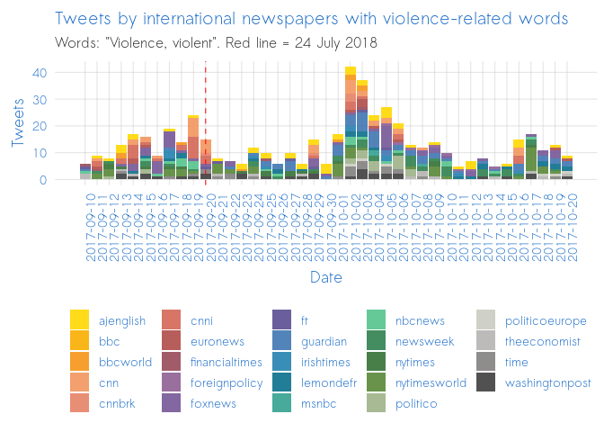

Since international news sources cover many locations, we can restrict our analysis geographically. The below shows the same time period for international news sources, but restricting only to those tweets with a reference to Spain, Catalonia, or Barcelona. Note that there are no mentions of violence in the days in question.

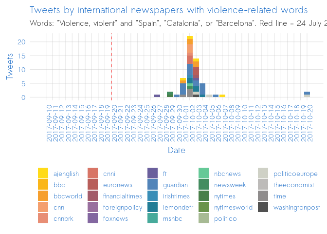

Is it conceivable that a public, violent uprising took place, and neither the Spanish nor international media thought that it was newsworthy?

Could it be that these newspapers simply do not cover violent protest stories? Let's take a look at other violent events and see.

### B.

*During actual violent events, the frequency of violence-related words corresponds chronologically with the violence.*

If we look only at the use violence-words and a geographic reference to Charlottesville ("Charlottesville, Estados Unidos, EEUU, América"), we say that the newspapers' coverage of violence accurately tracks the real incidence of violent events.

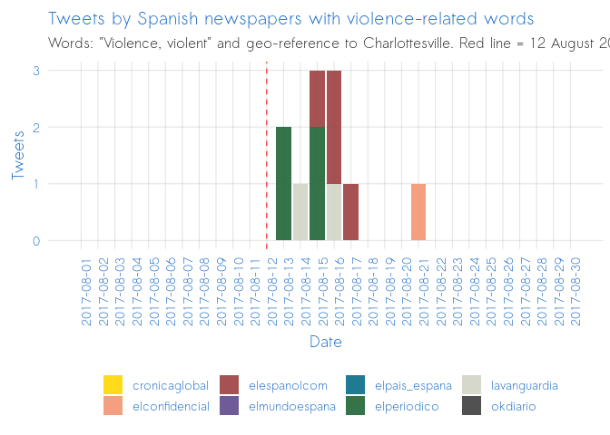

The above demonstrates that these papers do tweet in a timely fashion on violent protests. Why then, did they not tweet about Mr. Cuixart's protest? Could it be that there was no significant violence?

Let's examine the same period, but for international newspapers (those papers which did not tweet about violence in Spain/Catalonia/Barcelona at all from Sep 20-22, 2017). As per the above chart, the below chart shows violence-words which are geo-tagged relevantly (Charlottesville, USA, Virgina). Note that the frequency in violence-related tweets coincides with the actual violent events.

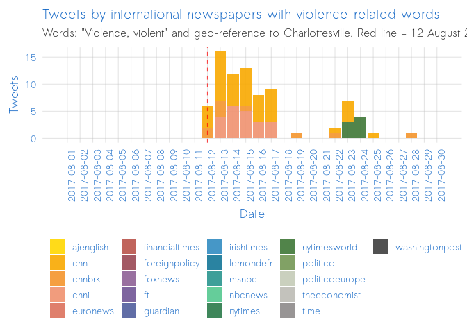

As another point of comparison, the below shows the Spanish newspapers' frequency of tweets with violence-related words during the July 2018 Barcelona taxi strike.

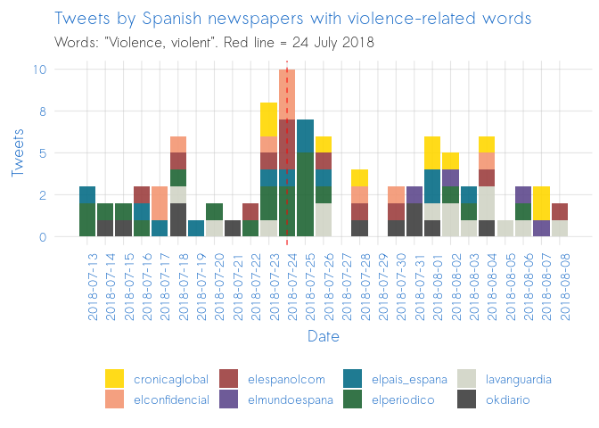

The below chart is identical to the above, but filtering only for those tweets which contain both a violence word ("violencia", "violento") and a relative geographical tag ("España", "Cataluña", "catalán", "catalana", "Barcelona").

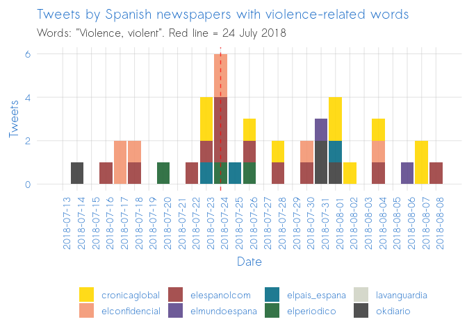

It is clear in the above that there is a notable peak in violence words on the date of actual violence. In both the taxi protests, and Charlottesville protests, these newspapers increased the frequency of tweets with violence-words. Why did they not do so after Mr. Cuixart's protest, if it was indeed a "violent" and "public" uprising?

As a final point of comparison, let's examine the protests which took place on October 1, 2018 (one year after the referendum). These same newspaper, which tweeted violence-words with a relevant geo-tag only 8 times during the 3 days during/after the period for which Cuixart faces charged, increased the frequency of violent terms significantly. From Oct 1 to Oct 3, 2018, violence-words were tweeted 55 times. Most of these tweets pertained to the protests at the Catalan Parlament (for which nobody is being charged with rebellion or sedition).

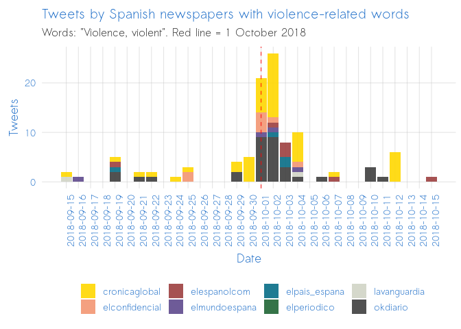

If a violent rebellion took place during a protest September 20-21 2017, why was the rate of the word "violence" 700% higher during a protest on October 1-2 2018?

Let's take a look at another case: the 2016 Turkish military coup d'etat attempt. This was very much a violent and public uprising, one more consistent with what the Spanish Penal Code describes as "rebellion".

The below shows the frequency of the words "violent", or "violence" from international news twitter accounts during the period of the Turkish coup attempt in July 2016 (filtering only for words which contain a relevant geographical tag: "Ankara", "Istanbul", and/or "Turkey"/"Turkish"). Note that, like with Charlottesville protests and Barcelona taxi protests, the increase in tweets coincides with the actual events.

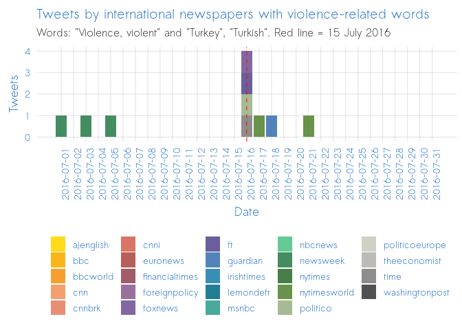

### C.

*Tweets from news sources mentioning "Cuixart" during the "uprising" were low.*

As the organizer of a public, violent uprising, we would expect a great deal of media coverage to mention the perpetrator of the crime in the immediate days following the crime. However, this is not the case.

The below shows tweets mentioning the name of Cuixart in the period immediately before and after the supposed violent uprising.

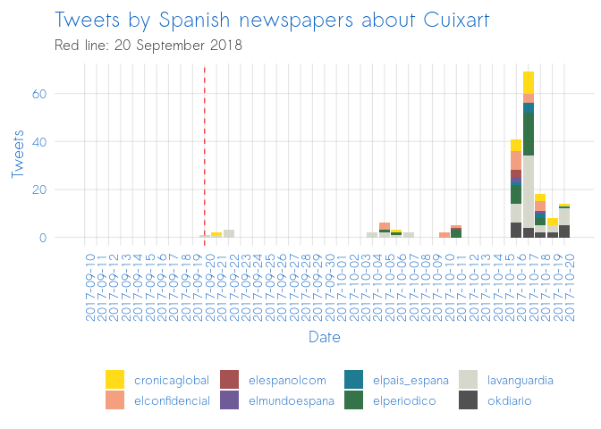

In the above it is clear that Cuixart's behavior did not merit significant media attention in the immediate days following the protests. Rather, the media became more interested in Cuixart one month later, when he was sent to prison.

What is more interesting? A person carrying out a violent and public uprising? Or a person being sent to prison for it?

Clearly, the former should be more interesting. The latter is only more interesting when it is a surprise, that is, when the actions carried out do not correspond with the public's expectation for the judicial reaction.

### D.

*Tweets from news sources mentioning the author of actual violent events corresponds more closely with the moment of violence.*

Let's compare the above chart with tweets mentioning the organizers of a truly violent protest in Charlottesville. In the days following the protest, news outlets tweeted the names of the protest organizers multiple times.

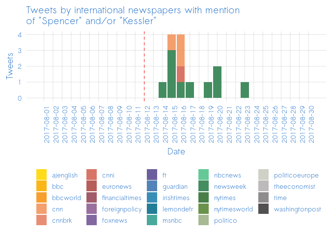

Conclusion
==========

Did Jordi Cuixart carry out a public and violent uprising on the night of September 20th, 2017? According to the data from Twitter, Google, Wikipedia, the answer is unequivocally not.

Rebellion is - by definition in the Spanish penal code - violent and public.

Violence is attention-worthy: when it occurs, politicians (particularly those opposed to the executors of the violence) tweet about it. Violence is news-worthy: when it occurs, newspapers write about it. Violence is interest-worthy: when it occurs, people search for the names of its organizers on google and wikipedia to learn more.

How is it, then, that Jordi Cuixart managed to carry out a violent and public uprising and almost nobody noticed at the time?

How is it, then, that in the immediate days after the uprising, the only references to "violence" from Jordi Cuixart's political opponents referred to other events, like simple assaults or gender violence?

How is it, then, that both the national and international media which were present during the protest of Sep 20-21 did not note levels of violence which were newsworthy?

How is it, then, that these same media tweet about violence in a timely fashion and at higher frequencies when violence occurs in other situations, but did not tweet about violence for Jordi Cuixart's supposed uprising?

How is it, then, that interest in Jordi Cuixart did not increase until he was sent to prison?

In real violent events, the patterns of social network, news, and search frequencies are similar: they peak rapidly in the immediate aftermath of the violence, and then decline thereafter This is the case for both violent-words ("violence" and "violent"), as well as for the organizers of violence (Kessler and Spencer). This is the case in the Barcelona taxi protests, the failed Turkish military coup, and the violent Charlottesville protests.

But for the events for which Jordi Cuixart is being charged, this is simply not the case. There is no notable peak in references to or searches of him, even by those most opposed to his policital aspirations. On the contrary, the peak does not come until later, when he is sent to prison. In other words, his entry into prison was considered more newsworthy than the supposed violent and public uprising.

Why would a violent criminal being sent to prison be considered so interesting? Why would the supposed crime be considered so uninteresting to the general public, the media, and politicians?

Could it be that the judiciary's actions were considered more shocking than Mr. Cuixart's?

The data surrounding the events of Mr. Cuixart's protest and entry in to prison show that there was significantly more surprise/interest in the latter event than the former. This is not consistent with a major, violent event. Rather, it is consistent with public surprise at a disproportionate decision to imprison an explicitly pacifist activist for having participated - among many others - in the organization of an explicitly protest.

The reason there was so little interest in and chatter about Cuixart immediately following the protest was because protest is, simply, normal. And the reason there was so much interest in and chatter about Cuixart immediately following his imprisonment was because imprisoning social activists is, simply, not normal.

Mr. Cuixart is not a violent rebel.

Appendix
========

<https://github.com/joebrew/vilaweb/tree/master/analyses/sep20/appendix.md>
