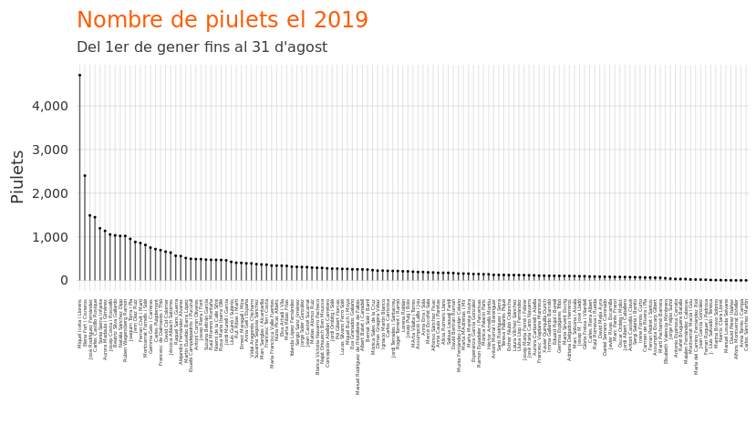
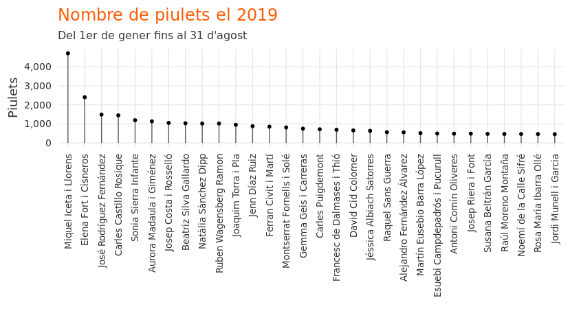
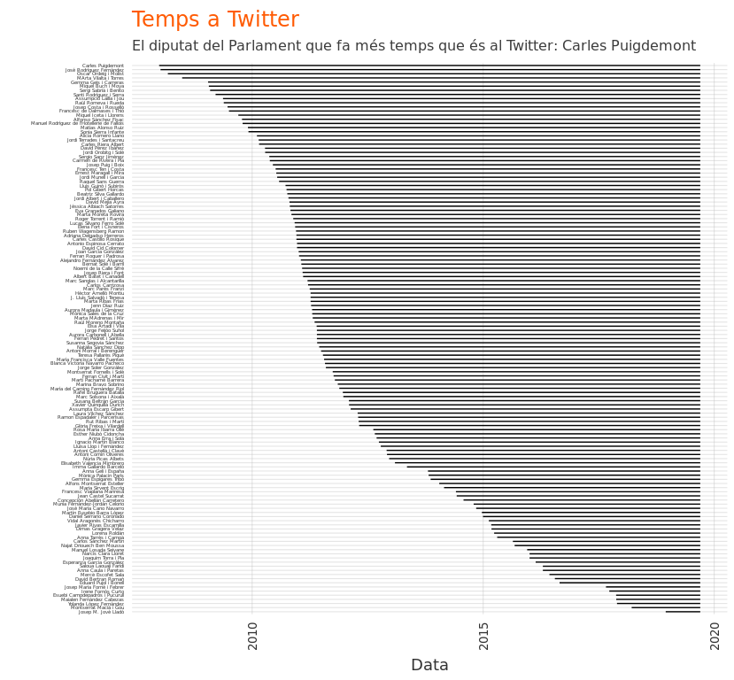
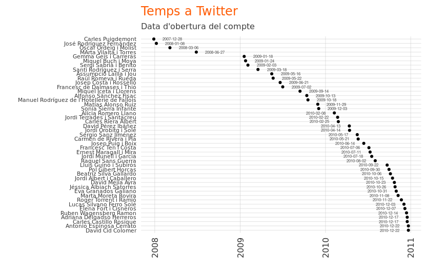
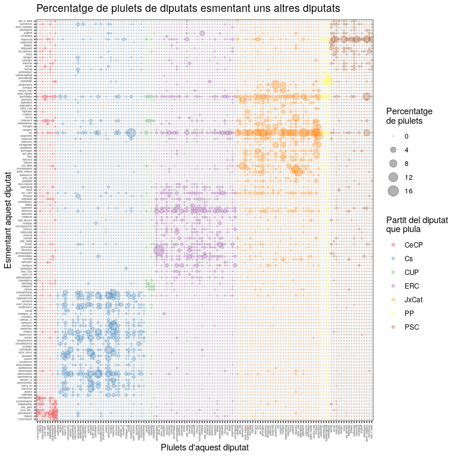
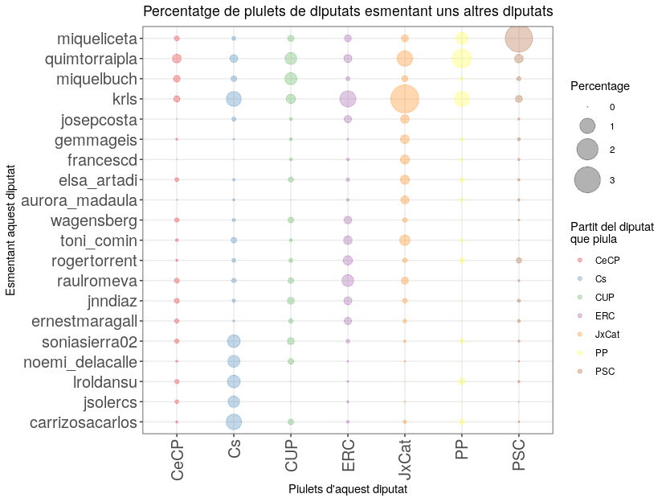
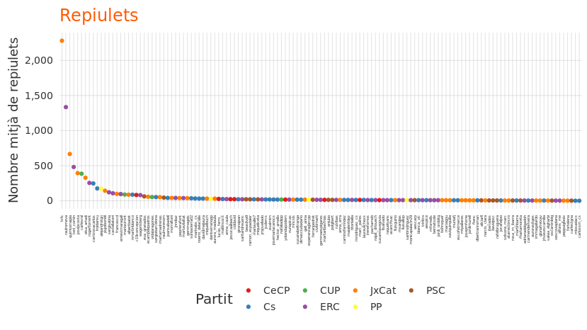
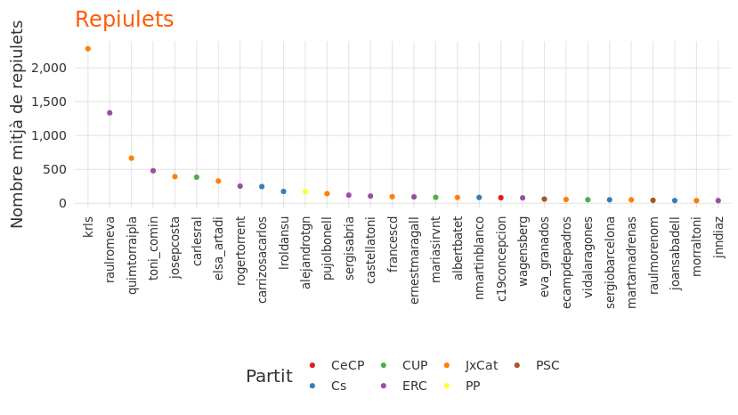

Els diputats del Parlament al Twitter
================

## Els diputats estan gairebé tots al Twitter

Dels 135 diputats al Parlament de Catalunya, 133 tenen un compte al
Twitter. No els estàs seguint? [Aquí](http://www.joebrew.net/diputats)
la llista.

Entre tots, han produit un corpus de documentació política d’interés.
532.865 piulets en total, 64.814.768 caracters de missatges, des del
2007. Analitzar cadascú de tots els 532.865 piulets seria molt
interessant, però massa feina per un article setmanal. Així que, fem un
anàlisi no del *contingut* dels piulets (les microdades), sinó de les
seves característiques (macrodades). Anem-hi.

## Qui piula més?

Dels 133 amb comptes de Twitter, alguns piulen menys i altres més… molt
més. El piulaire més prolífic del Parlament és el Miquel Iceta, cap de
llista dels Socialistes, amb 4705 piulets en 2019 fins al final del més
d’Agost ( per dia). Altres, com Alfons Montserrat, Anna Tarrés i Campa i
Carlos Sánchez Martín, no piulen gaire (només 1 piulet cadascu en 2019).
El gràfic següent mostra el nombre de piulets aquest any:

<!-- -->

Com que 133 diputats en un gràfic és una mica massa per poder distingir
bé, mirem només els 30 més piulaires.

<!-- -->

## Primers adoptants

La majoria dels diputats van obrir un compte entre 2010 i 2015. Alguns
no van obrir un compte fins 2018 (Josep M. Jové Lladó i Monsterrat Macià
i Gou); altres fa més de 10 anys (Carles Puigdemont i Jose Rodríguez).
El gràfic següent mostra quant de temps des de que cada diputat va obrir
un compte al Twitter.

<!-- -->

Aquí el mateix gràfic que l’anterior, però restringint només aquells que
van obrir un compte abans de l’any 2011:

<!-- -->

## L’eliminació de piulets

Moltes vegades, quan una persona arriba a tenir cert nivell de fama (per
exemple, quan entra en la política), fa una “neteja” de la seva
presència en les xarxes, treient aquelles coses que podrien ofendre o
desqualificar. Quan no es fa aquest exercici d’autocensura, hi ha
conseqüencies (per exemple, [Quim
Torra](https://www.elperiodico.com/es/politica/20180510/perlas-quim-torra-twitter-6810969)
i [Màxim
Huerta](https://www.elperiodico.com/es/politica/20180606/maxim-huerta-reacciones-twitter-6861393)
han sigut criticats per piulets escrits anys enrere). Com que anar
esborrant piulets un per un triga molt de temps, molta gent decideix fer
lo més facil: esborrar *tots* els piulets abans d’una certa data per
poder començar de nou sense que ningú pugui trobar cap “skeleton in the
closet”.

No es pot saber, retrospectivament, quans piulets han esborrat els
diputats. Però, es pot *endevinar* si han netejat les seves presències
online a través d’una senzilla comparació entre (a) la data del seu
primer tuit (disponible) i (b) la data de l’alta del seu compte. Si hi
ha molta diferència entre les dues dates (o sigui, un llarg period
després de l’obertura del compte sense cap piulet), sugereix que s’hagi
esborrat piulets.

<!-- -->

Miquel Buch va obrir un compte el 24 de gener de 2009, però el primer
piulet al seu timeline apareix més d’una década més tard, el 26 de
febrer de 2019. El mateix amb José Rodríguez Fernández: va obrir un
compte en 2008, però no hi ha cap piulet al seu TL fins a 2017. Ells (i
altres: David Pérez Ibáñez, Sergio Sanz Jiménez, Raúl Moreno Montaña,
etc.) van passar anys amb un compte, però sense piulets. Van guardar un
compte sense piular durant anys? O van esborrar piulets?

Suposant que un period de dos anys o més entre l’obertura d’un compte i
la primera aparició d’un piulet al timeline sugereix l’eliminació de
piulets, el partit que més ha esborrat piulets hisòrics seria Ciutadans:
7 dels seus 36 diputats tenen un “forat” de dos anys o més als seus TLs
després de l’obertura dels seus comptes fins al primer piulet.

## Qui parla de qui?

És interessant veure fins quin punt els diputats interactuen amb els
seus colegas a la xarxa social. El gràfic següent mostra les
“interaccions” al Twitter (quan un esmenta/etiqueta a un altre) desdel
princip de 2017 fins al 31 d’Agost de 2019. L’eix x és el diputat que
piula, i l’eix-y és el diputat esmentat.

Lo clar en aquest gràfic és que els diputats tendeixen a parlar només
dels del seu propi partit. Esmenten els seus companys de partit, i en
general ignoren els diputats de partits rivals. Les excepcions notables
són Carles Puigdemont i Quim Torra, que són esmentats per tots els
partits amb bastant freqüència. Curiosament, els diputats de Ciutadans
esmenten a Carles Puigdemont fins i tot que als diputats del seu propi
partit.

<!-- -->

Com que el gràfic anterior és una mica dificil d’interpretar degut al
nombre gran de diputats, restringim-ho una mica. Ara, a l’eix-X
l’aggregació de tots els piulets del partit, i a l’eix-y només els 20
polítics més esmentats.

<!-- -->

## Repiulets i m’agradas

Una cosa és piular. L’altre és que la gent et llegeix i li agrada el
missatge que transmets. Si mirem el nombre “retweets” (repiulets)
mitjans per piulet, és clar que differents partits tenen més o menys
efectivitat en la xarxa.

El gràfic següent mostra el nombre de repiulets mitjà per cada diputat,
del principi de 2019 fins al final d’agost.

<!-- -->

Com que 133 és molt per veure en un sol gràfic, restringim-ho a només el
30 diputats més repiulats:

<!-- -->

El que destaca és que els primers 8 llocs van a diputats de partits
sobiranistes. El diputat més repiulat dels unionistes, Carlos Carrizosa,
rep 247 repiulets per cada piulet, mentres que Carles Puigdemont rep
gairebé 10 vegades més (2,281 per cada piulet).

## Conclusió

[Twitter no és la vida
real](https://www.vilaweb.cat/noticies/twitter-contra-vida-real-joe-brew/).
És més jove, més catalanoparlant, més independentista, i més esquerdista
que la població general a Catalunya. Això explica, en grant part, per
què els piulets de polítics sobiranistes són molt més repiulats que els
polítics de polítics unionistes.

Però Twitter és util. Les seves dades són obertement accessibles, i com
que gairebé tots els diputats hi són, ens ofereix als analistes un mitjà
incomparable per medir tendències i interessos. Per exemple, encara que
no sigui (segons la llei espanyola) President de la Generalitat, Carles
Puigdemont encara atrau més interés (tant dels seus rivals polítics que
dels seus aliats) que altres polítics.

# Technical details

The code for this analysis is publicly available at
<https://github.com/joebrew/vilaweb/tree/master/analyses/twitter_diputats>.
