Relat i realitat: la violència a Barcelona
================

If you are a reader of Spanish print newspapers, you might think that
Barcelona erupted into a civil war this month. The headlines refer, day
after day, to violent crime, homicide, robberies, riot police, and the
general issue of insecurity.

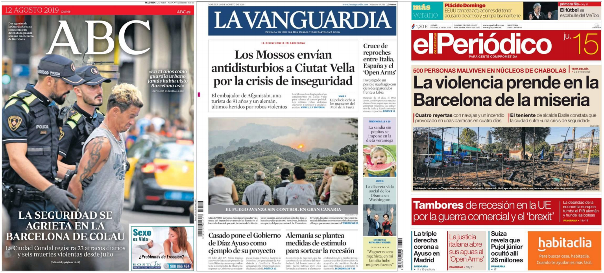

Politicians, particularly those from the political right, have hopped on
board as well, calling the situation in Barcelona an “emergency” and
denouncing the leftist mayor of Barcelona, Ada Colau.

<table style="width:100%">

<tr>

<td>


</td>

<td>


</td>

<td>


</td>

</tr>

</table>

So, are they right? Is the increase in cases of crime in Barcelona a
reflection of reality, or of a “relat” (narrative)? Let’s explore the
data.

## The reality

Reliable data on crime in Barcelona are available from two sources: the
Spanish Ministry of the Interior and the Catalan police (Mossos
d’Esquadra). The Ministry data are likely the most comprehensive
(including multiple police sources), but are only up to date through the
first trimester of 2019 (and therefore largely irrelevant to the
conversation about the *current* supposed crisis in security in
Barcelona). The below shows the number of crimes in Barcelona per
trimester, per the Ministry of the Interior:

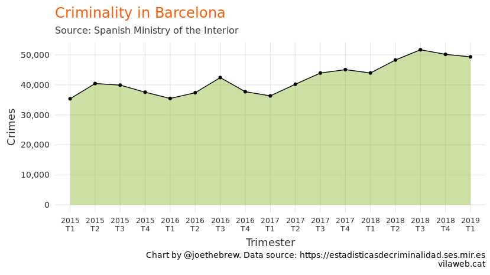<!-- -->

The data from the Mossos are more detailed (by month rather than
trimester) and slightly more up to date (going through the end of June).
The below shows crimes known to the Mossos over the last few years.

<!-- -->

As can be seen above, there is certainly a gradual increase over time,
but nothing extraordinary in the last few months. Let’s look more
specifically just at violent robbery (the crime that gets the most
attention in the media):

<!-- -->

Again, there are notable increases over the last few years, but not
especially in the last few months.

## The relat (the narrative)

The data on criminality is pretty straightforward: crime is going up in
Barcelona, but there has been no particular change over the last few
months. And even with the increases this year, Barcelona remains safter
than most other European cities.

But the narrative, in both the news media and social media, is not in
close contact with reality. Whereas increases in crime in Barcelona have
been gradual, *talking about* crime in Barcelona has skyrocketed over
recent weeks.

For this analysis, we gathered 754514 tweets from 35 Catalan and Spanish
newspapers. The full list can be seen at the end of this article. We
identified all tweets which contained both the word “Barcelona” and a
word referring to violence and/or crime (“violència”, “inseguretat”,
“delictes”, “crim”) in both Spanish and Catalan.

The below chart shows the combined number of monthly tweets from these
35 newspapers mentioning the crime situation in Barcelona:

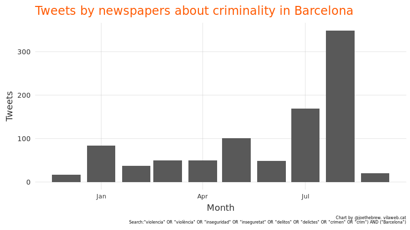<!-- -->

If we look by day over just the last few weeks, the rapid increase is
even more striking.

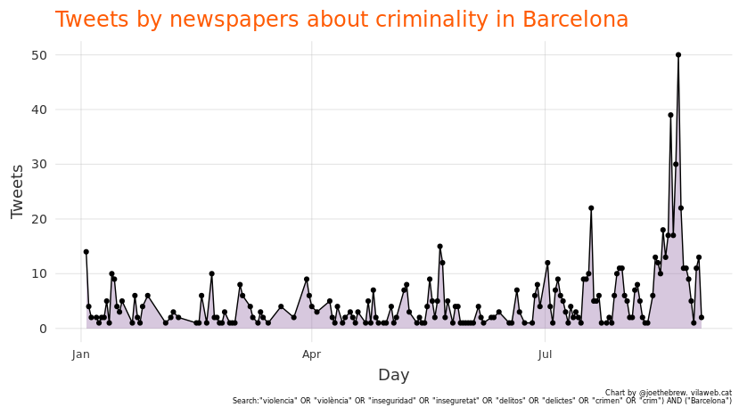<!-- -->

Let’s break it down by which newspapers, by week.

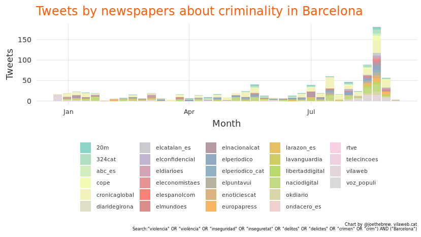<!-- -->

Finally, we can examine which newspapers by day:

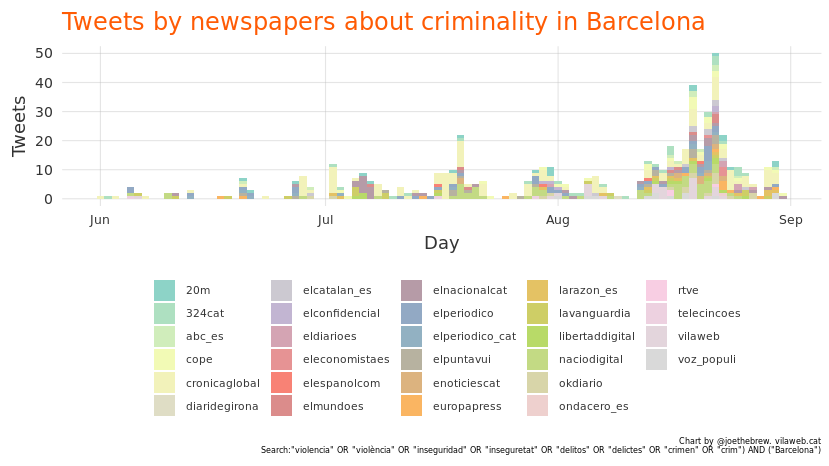<!-- -->

The increased newspaper coverage has had an effect on the general
population. The below shows unique monthly tweets mentioning criminality
or violence (using the same search query as above) and Barcelona in
Twitter in general, since the beginning of 2018.

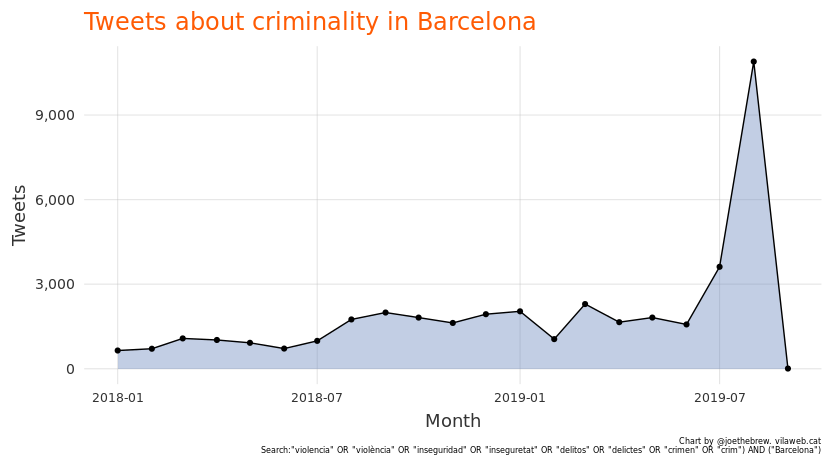<!-- -->

Let’s look at the same data, but at the daily level and only for the
last few months. The below shows the number of daily unique tweets
criminality or violence and Barcelona.

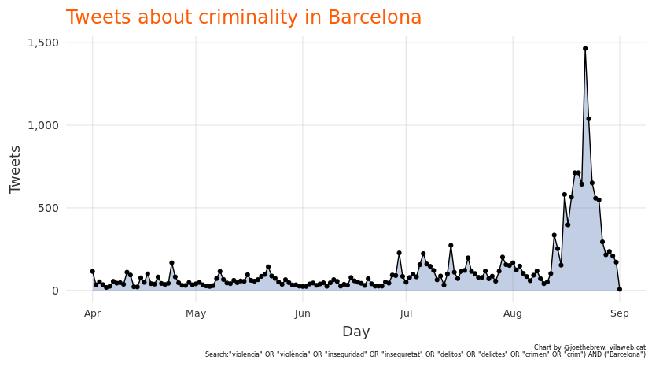<!-- -->

## Comparing reality and narrative (relat)

Let’s examine a comparison between reality and relat (narrative). The
below chart shows “reality” on the left (known number of monthly crimes
and violent robberies) and “relat” (narrative) on the right (tweets from
both newspapers and the population as a whole mentioning violence and
criminality in Barcelona). The numbers have been standardized to
percentage of “normal”, ie 200% means that there is twice the normal
rate, and 50% means there is half the normal rate.

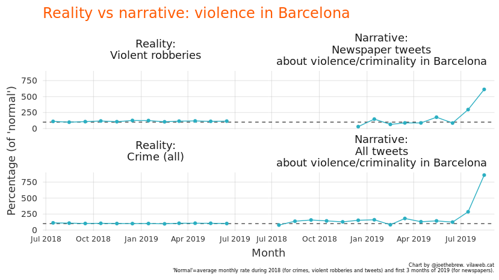<!-- -->

Both reality and relat (narrative) show an increase in criminality and
violence in Barcelona, but the proportionality is totally lacking.
Whereas violent robberies were up 10-12% in the most recent months for
which data is available realtive to “normal” (2018), tweets about
violence and criminality in Barcelona increased by 500%.

# Interpretation and Conclusion

Two things stand out in this analysis:

1.  **Disproportionality of coverage**: The disproportionality between
    the relatively moderate increases in criminality in Barcelona and
    the extreme increases in newspaper coverage about criminality in
    Barcelona.

2.  **Timing of coverage**: The arbitrariness of the timing of the
    newspaper coverage about criminality.

In other words, over the last month, reality and relat (narrative)
diverged. With no new data available on crime since June, and with no
data suggesting a particular uptick in the rate of crime in the last few
weeks, newspapers - and people - began talking incessantly about crime
in Barcelona. The rate hit fever pitch over the last week, with dozens
of newspapers covering multiple stories on the security “crisis” in the
Catalan capital.

Why did the increase take place *now*? And why is the (major) increase
in coverage about violence and criminality in Barcelona so
disproportionate to the actual (relatively minor) increase in violence
and criminality?

It’s helpful to consider the importance of the mental “frame” of both
journalists and their readers in trying to understand how a story
catches fire, and what motivates editorial decisions. The case of the
virality of the Barcelona-crime news angle could be an example of a
“feedback loop” or “echo chamber”. It works like this: a violent event
occurs (a stabbing, for example), journalists write about it, not much
else is going on in the news these days, so the story about the violent
event gets the most clicks, which motivates journalists to write more
about violent crime in Barcelona, which feeds a sense of fear in the
population, which motivates more people to click on and retweet stories
about violent crime, which motivates journalists to write more about it,
etc. As the echo chamber grows in volume, journalists from other news
organizations feel obliged to also cover the story (since “everyone is
talking about it”), and politicians must also comment on it. Then, more
stories are written about what politicians said about it. And there are
even [stories about
stories](https://www.lavanguardia.com/local/barcelona/20190821/464198797476/bbc-ola-crimenes-barcelona.html)
about it.

In the feedback loop, we are all at fault for the disconnect between
reality and relat. In fact, we actively *create* that disproprtionality
by choosing what to discuss, what to write about, what to like or
retweet, and what to ignore. In this sense, journalism is demand-driven:
we demand sensationality (as demonstrated by what we click on), and
journalism provides. Classic economics: supply and demand. I myself am
contributing to the feedback loop by choosing to write about criminality
in Barcelona for this article.

But to say that all are to blame does not mean that all are to blame
*equally*. Journalists have an ethical responsibility to maintain some
allegiance to reality, even if this means passing on the opportunity to
publish a “clickworthy” headline. When the institution of journalism
does nothing to push back against a narrative which is increasingly
decoupled from reality - and in some cases even contributes to the
narrative - it fails to fulfill its responsibility to society.

Publishing headline stories on violent crime in Barcelona, day after
day, at an unprecented rate, at an arbitrary moment in terms of the
actual rate of crime, might be good for business - but it does not
reflect well on the professionality of journalism. Sure, journalism
should be *demand-driven* - journalists should write stories about the
things people want to read about. But it should also be
*reality-driven*. And in the case of Barcelona’s apparent crime
“crisis”, reality plays only a minor role.

## List of newspapers analyzed

    20m
    324cat
    abc_es
    cadanaser_espa
    ccmaa_cat
    cope
    cronicaglobal
    diariaara
    diaridegirona
    elcatalan_es
    elconfidencial
    eldiarioes
    eleconomistaes
    elespanolcom
    elmundoes
    elnacionalcat
    elpais
    elpais_espana
    elperiodico
    elperiodico_cat
    elpuntavui
    enoticiescat
    europapress
    larazon_es
    lavanguardia
    laverdad_es
    libertaddigital
    naciodigital
    okdiario
    ondacero_es
    publico
    rtve
    telecincoes
    vilaweb
    voz_populi

# Catalan language charts

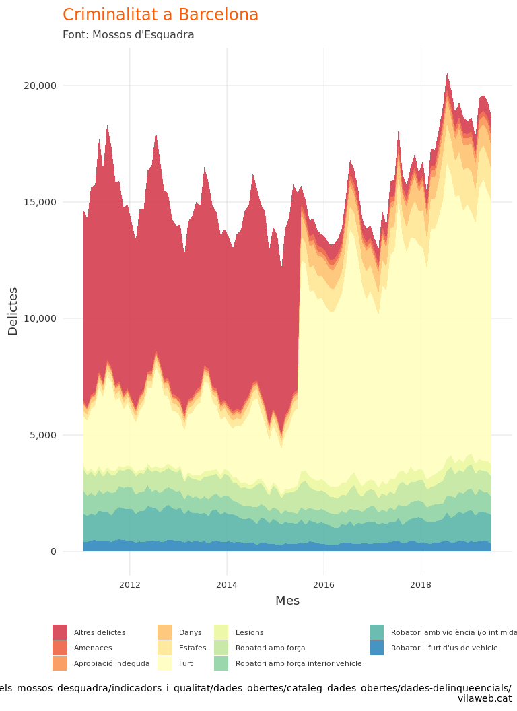<!-- -->

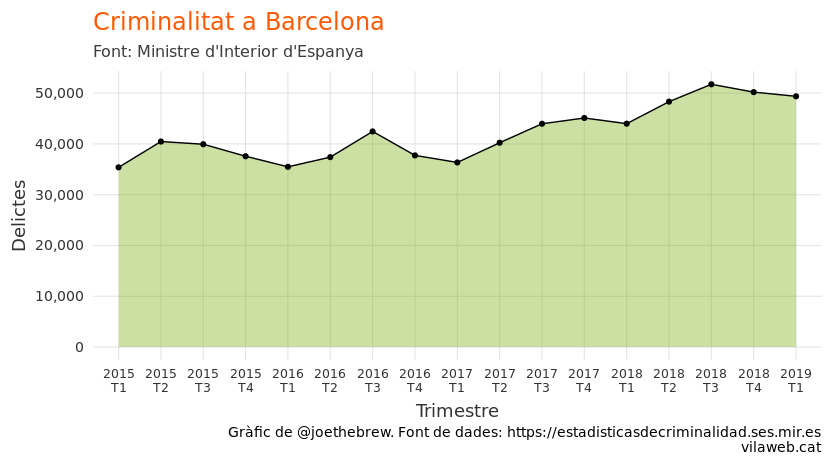<!-- -->

<!-- -->

<!-- -->

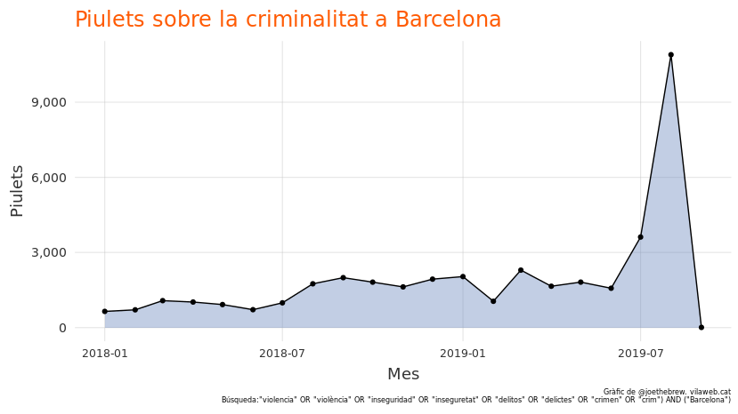<!-- -->

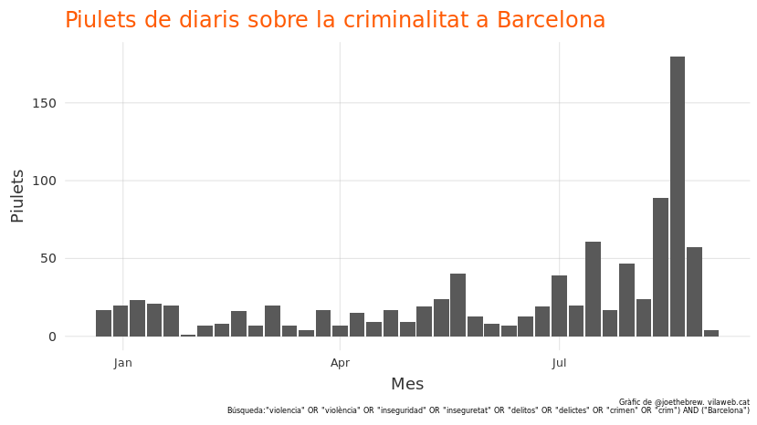<!-- -->

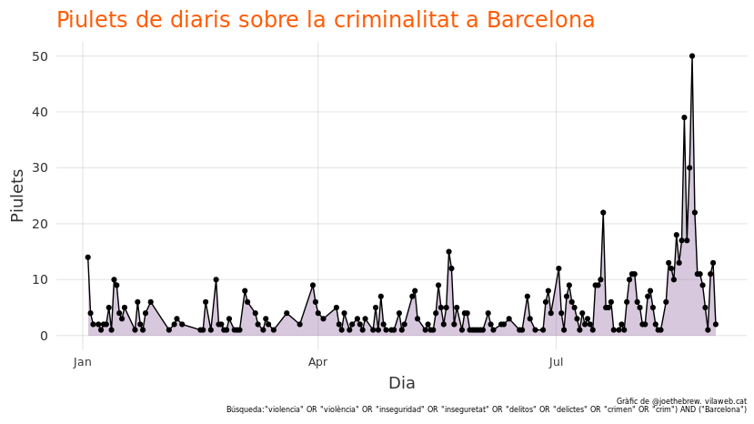<!-- -->

<!-- -->

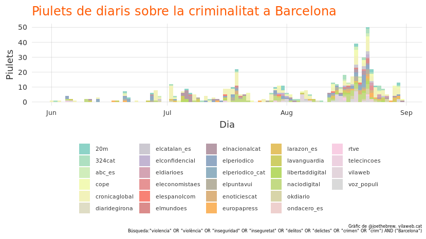<!-- -->

    [[1]]

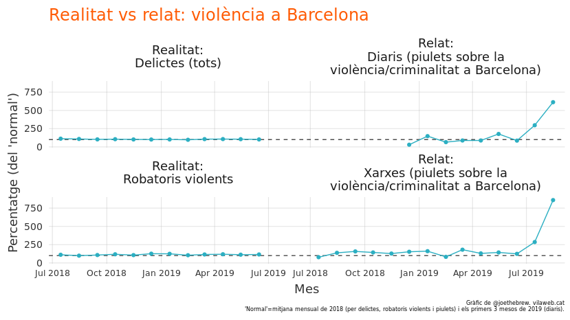<!-- -->

``` 

[[2]]
```

<!-- -->

``` 

[[3]]
```

<!-- -->

``` 

[[4]]
```

<!-- -->

``` 

[[5]]
```

<!-- -->

``` 

[[6]]
```

<!-- -->

``` 

[[7]]
```

<!-- -->

``` 

[[8]]
```

<!-- -->

``` 

[[9]]
```

<!-- -->

``` 

[[10]]
```

<!-- -->

``` 

[[11]]
```

<!-- -->

``` 

[[12]]
```

<!-- -->

``` 

[[13]]
```

<!-- -->

``` 

[[14]]
```

<!-- -->

``` 

[[15]]
```

<!-- -->

``` 

[[16]]
```

<!-- -->

``` 

[[17]]
```

<!-- -->

``` 

[[18]]
```

<!-- -->

``` 

[[19]]
```

<!-- -->

``` 

[[20]]
```

<!-- -->

``` 

[[21]]
```

<!-- -->

``` 

[[22]]
```

<!-- -->

``` 

[[23]]
```

<!-- -->

``` 

[[24]]
```

<!-- -->

``` 

[[25]]
```

<!-- -->

``` 

[[26]]
```

<!-- -->

``` 

[[27]]
```

<!-- -->

``` 

[[28]]
```

<!-- -->

``` 

[[29]]
```

<!-- -->

``` 

[[30]]
```

<!-- -->

``` 

[[31]]
```

<!-- -->

``` 

[[32]]
```

<!-- -->

``` 

[[33]]
```

<!-- -->

``` 

[[34]]
```

<!-- -->

``` 

[[35]]
```

<!-- -->

``` 

[[36]]
```

<!-- -->

``` 

[[37]]
```

<!-- -->

``` 

[[38]]
```

<!-- -->

``` 

[[39]]
```

<!-- -->

``` 

[[40]]
```

<!-- -->

``` 

[[41]]
```

<!-- -->

``` 

[[42]]
```

<!-- -->

``` 

[[43]]
```

<!-- -->

``` 

[[44]]
```

<!-- -->

``` 

[[45]]
```

<!-- -->

``` 

[[46]]
```

<!-- -->

``` 

[[47]]
```

<!-- -->

``` 

[[48]]
```

<!-- -->

``` 

[[49]]
```

<!-- -->

``` 

[[50]]
```

<!-- -->

``` 

[[51]]
```

<!-- -->

``` 

[[52]]
```

<!-- -->

``` 

[[53]]
```

<!-- -->

``` 

[[54]]
```

<!-- -->

``` 

[[55]]
```

<!-- -->

``` 

[[56]]
```

<!-- -->

``` 

[[57]]
```

<!-- -->

``` 

[[58]]
```

<!-- -->

``` 

[[59]]
```

<!-- -->

``` 

[[60]]
```

<!-- -->

``` 

[[61]]
```

<!-- -->

``` 

[[62]]
```

<!-- -->

``` 

[[63]]
```

<!-- -->

``` 

[[64]]
```

<!-- -->

``` 

[[65]]
```

<!-- -->

``` 

[[66]]
```

<!-- -->

``` 

[[67]]
```

<!-- -->

``` 

[[68]]
```

<!-- -->

``` 

[[69]]
```

<!-- -->

``` 

[[70]]
```

<!-- -->

``` 

[[71]]
```

<!-- -->

``` 

[[72]]
```

<!-- -->

``` 

[[73]]
```

<!-- -->

``` 

[[74]]
```

<!-- -->

``` 

[[75]]
```

<!-- -->

``` 

[[76]]
```

<!-- -->

``` 

[[77]]
```

<!-- -->

``` 

[[78]]
```

<!-- -->

``` 

[[79]]
```

<!-- -->

``` 

[[80]]
```

<!-- -->

``` 

[[81]]
```

<!-- -->

``` 

[[82]]
```

<!-- -->

``` 

[[83]]
```

<!-- -->

``` 

[[84]]
```

<!-- -->

``` 

[[85]]
```

<!-- -->

``` 

[[86]]
```

<!-- -->

``` 

[[87]]
```

<!-- -->

``` 

[[88]]
```

<!-- -->

``` 

[[89]]
```

<!-- -->

``` 

[[90]]
```

<!-- -->

``` 

[[91]]
```

<!-- -->

``` 

[[92]]
```

<!-- -->

``` 

[[93]]
```

<!-- -->

``` 

[[94]]
```

<!-- -->

``` 

[[95]]
```

<!-- -->
