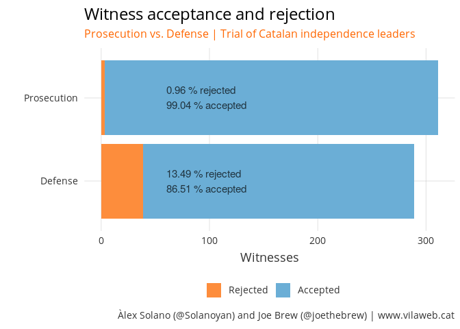
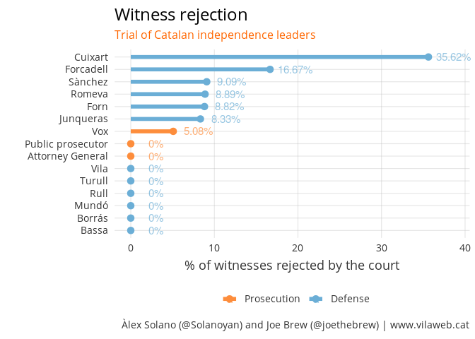
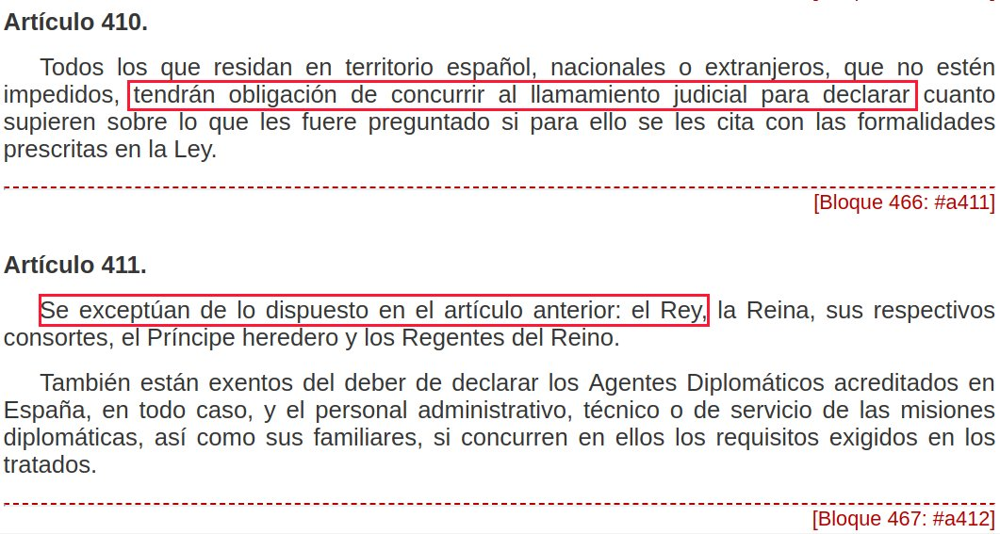
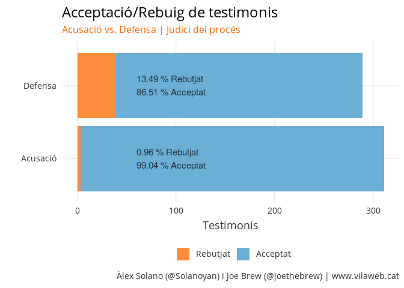
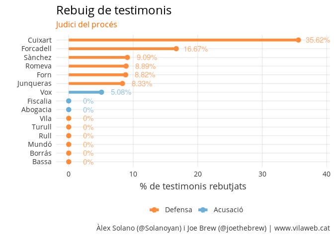
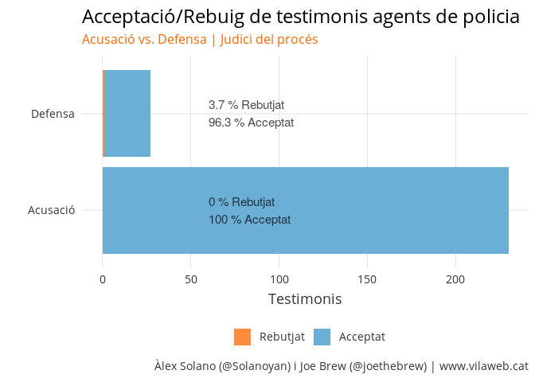

Quantifying witness exlcusion in Spain's trial of Catalonia's political leaders
================

By Àlex Solano and Joe Brew

Introduction
============

Article 6 of the [European Convention on Human Rights](https://www.echr.coe.int/Documents/Convention_ENG.pdf) pertains to the "Right to a Fair Trial". Article 6 § 3(d) states that everyone has the right "to examine or have examined witnesses against him and to obtain the attendance and examination of witnesses on his behalf under the same conditions as witnesses against him". [Council of Europe guidance on Article 6](https://rm.coe.int/1680304c4e) do not require that courts accept *all* witnesses proposed by the defence, but *do* require that acceptance of witnesses be made "under the same conditions" with "equality of arms" (ie, "that a fair balance be struck between the parties").

The Spanish Supreme Court has just begun the trial of 12 Catalan political and social leaders on charges of violent rebellion. As part of the pre-trial proceedings, the court made public the [list](http://datacat.cc/admisiondepruebas.pdf) of which witnesses and documentary evidence the court chose to accept or reject.

In this analysis we will explore whether the Supreme Court accepted witnesses from the defense and prosecution, with a focus on the question of "a fair balance" with "equality of arms". Specifically, we will compare rates of witness rejection between those witnesses proposed by the defense vs. those proposed by the prosecution.

Methods
=======

We transcribed the Court's 145-page "admission of evidence" [document](http://datacat.cc/admisiondepruebas.pdf) into a standardized and [machine-readable format](https://docs.google.com/spreadsheets/d/1GhRC2nX3ysy2zPbwBqeVsah5gz-y2R6GFwxy2Ejt4lo/edit#gid=0) and then analyzed rates of witness acceptance and rejection from both sides of the trial (defense and prosecution).

Some technical details
----------------------

In this case, there are 12 defendants:

Bassa Borrás Cuixart Forcadell Forn Junqueras Mundó Romeva Rull Sànchez Turull Vila

In this case, there are 3 parties in the prosecution:

1.  Fiscalia (the public prosecutor)
2.  Abogacia (the government's lawyer, equivalent of the American Attorney General)
3.  Vox (a far-right political party, which is playing the role of the "popular" prosecution)

We will analyze rates of witness exclusion both at the level of the individual parties, as well as aggregated in the defense-prosecution groups.

Witnesses can be divided into two types: (1) general witnesses (testigos) and (2) expert witnesses (peritos). For the purpose of this analysis, we combine these categories and henceforth refer to them all as "witnesses".

Results
=======

Overall acceptance / rejection
------------------------------

Overall, 560 witnesses (testigos) and expert witnesses (peritos)were proposed by the lawyers on each side; 311 by the prosecution and 289 by the defense. Of the 311 proposed by the prosecution, 308 were accepted (99%), whereas of the 289 proposed by the defense teams, 250 were accepted (87%). In other words, 13% of the witnesses proposed by the defense were rejected, whereas only 1% of the witnesses proposed by the prosecution were rejected.

The below table shows the raw numbers.

| Defense     |  Rejected|  Accepted|  Proposed|
|:------------|---------:|---------:|---------:|
| Defense     |        39|       250|       289|
| Prosecution |         3|       308|       311|

Acceptance / rejection by proposing party
-----------------------------------------

Let's dig in a bit further and examine the individual parties. The court accepted 100% of the proposed witnesses from both the public prosecutor (Fiscalia) and Attorney General (Abogacia). It also accepted 100% of half of the defendants' proposed witnesses.

However, of the 42 witnesses which the court chose not to accept, 39 were from the defense. The court only rejected a total of 3 witnesses proposed by the prosecution (all 3 from the far-right party VOX).

Most affected by the court's rejections was the defense of social activist Jordi Cuixart, for whom the court found more than one third of the proposed witnesses to be "impertinent". Carme Forcadell, the speaker of the Catalan parlament, had a rejection rate of 16.7%. 4 other defendants (Sànchez, Romeva, Forn and Junqueras) had rejection rates of approximately 8-9%.

The below table shows the raw numbers.

| Side of trial | Proposed\_by |  Rejected|  Accepted|  Proposed|
|:--------------|:-------------|---------:|---------:|---------:|
| Defense       | Bassa        |         0|         8|         8|
| Defense       | Borrás       |         0|         4|         4|
| Defense       | Cuixart      |        26|        47|        73|
| Defense       | Forcadell    |         2|        10|        12|
| Defense       | Forn         |         3|        31|        34|
| Defense       | Junqueras    |         8|        88|        96|
| Defense       | Mundó        |         0|         6|         6|
| Defense       | Romeva       |         8|        82|        90|
| Defense       | Rull         |         0|         5|         5|
| Defense       | Sànchez      |         8|        80|        88|
| Defense       | Turull       |         0|        16|        16|
| Defense       | Vila         |         0|         4|         4|
| Prosecution   | Abogacia     |         0|       255|       255|
| Prosecution   | Fiscalia     |         0|       264|       264|
| Prosecution   | Vox          |         3|        56|        59|

The over-weighted representation of police forces
-------------------------------------------------

One of the most striking elements of the court's accepted list is the large number of witnesses who are police officers. 243 of the 560 total proposed witnesses (43.4%) are members of police forces. Of those 243, 242 were accepted by the court.

The defense teams only proposed a total of 27 police officers, of whom 26 were accepted for testimony. The prosecution, on the other hand, proposed a total of 230 police officers. The court accepted the testimony of all 230.

The only police officer requested by any of the lawyers who the court did not accept as a witness was Ignacio Cosidó. He was requested by the defenses of Romeva and Junqueras. The court chose to reject his testimony despite the fact that more than 80% of the officers testifying [were under his command during the events in question](https://www.publico.es/politica/juicio-proces-marchena-veta-testigos-pruebas-falta-imparcialidad-instruccion.html). The court justified its rejection of Cosdidó based on supposed concerns of impartiality. It should be noted that Cosidó previously boasted that his party (the conservative PP) would be able to control the Supreme Court ["from behind"](https://www.thenational.scot/news/17234171.peoples-party-will-control-trials-of-catalan-leaders/) based on political arrangements. The fact that the Supreme Court chose to reject his testimony even though he played an important role in the events in question raises reasonable doubt regarding the court's motives.

The King's absence
------------------

The testimony of Felipe de Borbón was requested by the defense team of Jordi Sànchez, since de Borbón's words and acts appear in the court documents prepared by Judge Llarena. The court justified not calling him to testify by citing Article 411 of the Criminal Code. The Judiciary also published a [press note](http://www.poderjudicial.es/cgpj/es/Poder-Judicial/Noticias-Judiciales/La-Sala-del-TS-que-enjuiciara-el-caso-del--Proces--notifica-el-auto-de-admision-de-prueba-y-fija-para-el-12-de-febrero-el-inicio-de-la-vista) stating that since de Borbón is the King his testimony is "explicitly prohibited" by Article 411.

However, Article 411 simply says that the King is exempt from the *obligation* to testify. It does not "prohibit" the King's testimony.

In other words, it would have been legal to call Felipe de Borbón as a witness, as per the request of the defense team. Borbón could have simply chosen not to testify, just as a defendant can choose to remain silent. As monarch, he has this privilege, unavailable to the rest of Spaniards. Whether the court's confusion between "exempt" and "prohibited" is accidental or an intentional attempt to avoid a witness considered important to the defense is unknown.

Other notable rejections
------------------------

The court only rejected 3 witnesses proposed by the prosecution, all because the request pertained to actions carried out prior to the events on trial.

However, the court rejected 39 of the witnesses proposed by the defense. These includes Catalan political leaders like Carles Puigdemont and Marta Rovira - the court justified their exclusion because their condition of being under investigation was incompatible with the "obligation to tell the truth". Oddly, the court did not apply the same logic in choosing to accept the testimony of Joseph Lluis Trapero (former chief of the Catalan police who is also under investigation).

The rejections of witnesses requested by the defense also include UN experts, Nobel prize laureates, British and Irish police investigators, historians, and others. The court justified these disqualifications because these witnesses' "personal valorations" would not be relevant to "that which is sctrictly factual or juridic". These rejections directly weaken the argument of the defenses that the events of September and October 2017 must be understood through the lens of both (a) the universal right to self-determination and (b) the historical events leading up to the referendum.

Summary
=======

-   13.5% of the witnesses proposed by the defense were rejected by the Supreme Court.
-   Less than 1% of the witnesses proposed by the prosecution were rejected.
-   242 of the 518 witnesses accepted by the court are police officers.
-   The court rejected no witnesses from the Attorney General or Public Prosecutor.
-   The only police officer whose testimony was not accepted was in charge of 80% of the police officers whose testimonies were accepted at the time of the events in question.
-   More than 1 in 3 of the witnesses proposed by Jordi Cuixart were rejected by the court.
-   The Judiciary falsely claimed that the King's testimony was "explicitly prohibited", and used this supposed prohibition to justify his disqualification as a witness requested by the defense.

Personal reflection
===================

The [court's justification](http://datacat.cc/admisiondepruebas.pdf) for which witnesses were accepted and rejected is long (145 pages) and detailed. It provides reasons for the rejection of each of the defense's 39 disqualified witnesses. But the reasons are at times contradictory (as in the case of disqualifying Puigdemont and Rovira, but accepting Trapero), arbitrary (the disqualification of Cosidó) and false (the supposed "prohibition" of Mr. de Borbón's testimony).

The result of these questionable exclusions is a witness pool of 518 accepted witnesses of whom 47% are police officers. Of the 42 rejected witnesses, 93% were proposed by the defense. 13.5% of the defense's proposed witnesses were rejected, including individuals (such as Borbón and Cosidó) who played an important enough role in the events in question to be mentioned in prosecutorial documents.

The European Convention on Human Rights' Article 6 makes clear "that a fair balance be struck between the parties" in terms of the witnesses accepted to give testimony. Given the disproportionate rejection rates of the defense's proposed witnesses, the inconsistent rationale for rejections, and the abnormally high percentage of witnesses who are police officers, it would be hard to argue that the final witness list constitutes "a fair balance".

The question now is whether the European Union has the mechanisms and political will to intervene in an unfair trial, or whether the accused will have to wait until the case makes its way to Strasbourg. In the latter case, this biased witness pool will likely be a subject of examination. Tragically, by then, the defendants may have already spent years in prison as a result of a trial in which the cards were stacked against them.

Catalan-language plots
======================

